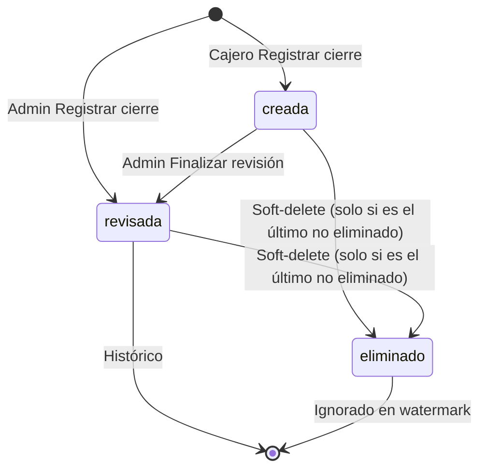

# Bolsillos / cuentas internas — planeación (opción B)

**Documento maestro:** [`POS-PLAN-MAESTRO.md`](./POS-PLAN-MAESTRO.md)  
**Handoff técnico actualizado:** [`ONBOARDING-FINANZAS-ORIGENES-CIERRES.md`](./ONBOARDING-FINANZAS-ORIGENES-CIERRES.md)  
**Relacionado:** [`finanzas-egresos-resumen-planificacion.md`](./finanzas-egresos-resumen-planificacion.md)  
**Estado:** **APROBADO** — B1–B5 hechos; **B8 workflow corte implementado** (2026-07-18);
B6/B7 **aplazados**; permisos MPOF completos y base de turno continúan por fases  
**Última actualización:** 2026-07-18

> Persona natural **NO responsable de IVA**. Los bolsillos son **control interno y ayuda gerencial**; el export de movimientos es **auxiliar para el contador**, no libro contable oficial ni declaración de renta.

---

## 1. Principio de diseño

```text
metodo_pago      = ¿Por dónde pasó el dinero?     (caja, Nequi, QR, transferencia) — tickets
origen_fondos    = ¿Dónde / para qué está?       (cajita, ahorro nómina, reserva proveedores)
movimiento_*     = Hecho auditable que cambia saldo (entrada, salida, traslado, ajuste)
egreso           = Hecho de negocio (pagué a proveedor) → genera SALIDA en origen_fondos
caja             = Puesto físico de cobro (Caja 1, Caja 2) — multi-caja futuro
```

**Regla universal:** todo egreso **siempre** resta saldo del origen de fondos elegido.  
`manejo_estricto_cuentas` solo define **bloqueo vs advertencia** si no alcanza.

---

## 2. Alcance vs lo existente

| Ya implementado (Sprint 4) | Este módulo agrega |
|----------------------------|-------------------|
| `metodo_pago` + flags ticket/egreso | `cuenta_bolsillo` con propósito y saldo lógico |
| `egreso.metodo_pago_id` | `egreso.cuenta_bolsillo_id` + movimiento automático |
| Cierre desfase por medio físico | `AJUSTE_CIERRE` con motivo CRUD |
| `metodo_pago.monto` referencial | Saldo por suma de `movimiento_bolsillo` |

**No romper:** cierre de turno sigue conciliando **medios físicos** (`metodo_pago`). Los bolsillos son capa **lógica/admin**.

---

## 3. Modo de operación — `establecimiento.manejo_estricto_cuentas`

| Modo | Egreso / salida | Traslado Nequi→Bancolombia | Cierre con desfase |
|------|-----------------|----------------------------|-------------------|
| **`true`** (estricto) | **Bloquea** si saldo origen &lt; valor | **Obligatorio** antes de pagar desde destino sin saldo | `AJUSTE_CIERRE` + motivo; valor corregido |
| **`false`** (flexible) | **Permite**; warning naranja si 0 / insuficiente / negativo | Recomendado en UI; no bloquea | Igual justificación de desfase |

Configurable en **Datos del negocio** (`/apps/tickets/configuracion-establecimiento`).

---

## 4. Modelo de datos (ER)

### 4.1 Catálogos

**`tipo_bolsillo`**

| codigo | nombre |
|--------|--------|
| `OPERATIVO` | Operativo del día |
| `RESERVA_PROVEEDORES` | Reserva surtir / proveedores |
| `FACTURA_PROVEEDOR` | Factura proveedor específico |
| `ARRIENDO` | Arriendo |
| `PRESTAMO` | Préstamo recibido |
| `TARJETA_CREDITO` | Tarjeta crédito empresa |
| `AHORRO` | Ahorro / nómina |
| `OTRO` | Otro |

**`motivo_movimiento`** (seeds + CRUD admin; `sistema=true` no eliminable)

| codigo | nombre | categoria |
|--------|--------|-----------|
| `PENDIENTE_EXTRACTO` | Pendiente ajustar en extracto del día | AJUSTE |
| `COMPRA_PERSONAL` | Compras personales / no actividad del negocio | AJUSTE |
| `PAGO_PAREJA_TC` | Movimiento tarjeta débito personal (pareja) | AJUSTE |
| `MAS_PROVEEDORES` | Más proveedores de lo planeado | BOLSILLO |
| `INSUMO_NO_PROGRAMADO` | Insumos o servicios no programados | BOLSILLO |
| `FALLA_SISTEMA_BANCO` | Posible falla sistema / banco en mantenimiento | AJUSTE |
| `AJUSTE_PERSONAL_FALTANTE` | Ajuste con dinero personal del administrador | AJUSTE |
| `OTRO` | Otro | AJUSTE |

### 4.2 `cuenta_bolsillo`

| Campo | Tipo | Notas |
|-------|------|-------|
| `id` | PK | |
| `nombre` | VARCHAR | Ej. «Ahorro nómina», «Factura COLTABACO» |
| `tipo_bolsillo_id` | FK | |
| `proveedor_id` | FK nullable | Si es factura de un proveedor |
| `metodo_pago_id` | FK nullable | Enlace 1:1 con medio operativo |
| `naturaleza` | ENUM | `FISICA`, `ELECTRONICA`, `MIXTA` |
| `visible_en_egreso` | BOOLEAN | Cajero puede elegir al egresar |
| `requiere_conciliacion` | BOOLEAN | Admin quiere seguimiento fino |
| `activo` | BOOLEAN | |
| `orden`, `color`, `notas` | | UI |

**Saldo:** `SUM(movimientos)` — no editar saldo directo.

### 4.3 `movimiento_bolsillo`

| Campo | Tipo | Notas |
|-------|------|-------|
| `tipo_movimiento` | VARCHAR | Ver §5 |
| `cuenta_bolsillo_id` | FK | Cuenta principal afectada |
| `cuenta_destino_id` | FK nullable | Solo `TRASLADO` |
| `valor` | NUMERIC | Siempre positivo; signo por tipo |
| `saldo_antes`, `saldo_despues` | NUMERIC | Snapshot auditoría |
| `fecha`, `fecha_creacion`, `usuario_id` | | |
| `metodo_pago_id` | FK nullable | Canal físico si aplica |
| `tercero_nombre` | VARCHAR | Ej. Juan Pérez (préstamo) |
| `motivo_movimiento_id` | FK nullable | |
| `observacion` | TEXT | |
| `valor_sistema`, `valor_real` | NUMERIC | Solo ajustes / cierre |
| `origen_tipo`, `origen_id` | | `EGRESO`, `MANUAL`, `CIERRE`, … |
| `grupo_traslado_id` | UUID | Par traslado origen↔destino |

### 4.4 Extensiones

| Tabla | Campo nuevo |
|-------|-------------|
| `establecimiento` | `manejo_estricto_cuentas BOOLEAN DEFAULT false` |
| `egreso` | `cuenta_bolsillo_id BIGINT NULL` (Sprint B4) |
| `ventas_tipo` / cierre | `motivo_ajuste_cierre_id` opcional (Sprint B5) |

---

## 5. Tipos de movimiento

| Código | Nombre UI | Efecto saldo cuenta origen | Efecto cuenta destino |
|--------|-----------|---------------------------|----------------------|
| `ENTRADA_MANUAL` | Ingreso manual | + valor | — |
| `ENTRADA_PRESTAMO` | Préstamo recibido | + valor | — |
| `TRASLADO` | Traslado entre cuentas | − valor | + valor |
| `SALIDA_EGRESO` | Pago / egreso | − valor | — |
| `SALIDA_DEVOLUCION_PRESTAMO` | Devolución préstamo | − valor | — |
| `AJUSTE_SALDO` | Ajuste de saldo | ± delta | — |
| `AJUSTE_CIERRE` | Ajuste por cierre de turno | ± delta | — |

### Flujos acordados

**Préstamo Juan Pérez → pagar proveedor (estricto):**

```text
1. ENTRADA_PRESTAMO  → bolsillo destino (+500.000, tercero=Juan Pérez)
2. TRASLADO opcional → bolsillo desde el que paga
3. SALIDA_EGRESO     → proveedor (−valor)
```

**Nequi → Bancolombia → un solo pago proveedor:**

```text
1. TRASLADO  cuenta Nequi → cuenta Bancolombia
2. SALIDA_EGRESO  desde Bancolombia
```

---

## 6. Permisos (roles JWT)

| Acción | admin | cajero | invitado |
|--------|-------|--------|----------|
| Ver bolsillos / saldos | ✓ | ✓ lectura | ✗ |
| Entrada manual, traslado, préstamo | ✓ | ✗ | ✗ |
| Ajuste saldo / cierre motivo | ✓ | ✗ | ✗ |
| CRUD motivos movimiento | ✓ | ✗ | ✗ |
| Egreso con selector bolsillo | ✓ | ✓ si `visible_en_egreso` | ✗ |
| Export movimientos contador | ✓ | ✗ | ✗ |

Seeds en `funcionalidad_pos`: `BOLSILLOS`, `MOTIVOS_AJUSTE`, `EXPORT_MOVIMIENTOS`.

---

## 7. UI planificada

| Ruta | Componente | Sprint |
|------|------------|--------|
| `/apps/financiero/bolsillos` | `bolsillos-list` | B2–B3 |
| Diálogo | `bolsillo-movimiento` (entrada, traslado, préstamo) | B3 |
| Diálogo | `bolsillo-ajuste` | B3 |
| `egreso-edit` | + selector `cuenta_bolsillo` | B4 |
| `cierre-ventas` | + motivo por desfase ≠ 0 | B5 |
| `configuracion-establecimiento` | toggle `manejo_estricto_cuentas` | B2 |
| Admin | CRUD `motivo_movimiento` | B3 |

**Cajero:** flujo egreso casi igual; warning naranja o bloqueo según modo.  
**Admin:** tarjetas con saldo, historial, acciones rápidas.

---

## 8. Sprints de implementación

### Sprint B1 — Fundación BD + catálogos ✅

| Repo | Entregable |
|------|------------|
| SQL | `12`–`15` + `apply-bolsillos-p1.sh` |
| BE | Entidades, repos, seeds, backfill cuentas desde `metodo_pago` |
| BE | `establecimiento.manejo_estricto_cuentas` |

### Sprint B2 — API movimientos + UI base ✅

| Repo | Entregable |
|------|------------|
| BE | `POST` entrada manual, préstamo, traslado, ajuste |
| BE | `GET` saldos, historial por cuenta |
| BE | Validación modo estricto |
| FE | Tab Bolsillos + toggle establecimiento + tarjetas + historial |

### Sprint B3 — UI completa bolsillos (parcial ✅)

| Repo | Entregable |
|------|------------|
| FE | Tarjetas, movimientos, diálogos entrada/traslado/préstamo/ajuste ✅ |
| FE | CRUD motivos ajuste — pendiente |
| BE | Permisos `funcionalidad_pos` — pendiente |

## Sprint B4 — Egreso ↔ origen ✅

| Repo | Entregable |
|------|------------|
| SQL | `egreso.origen_fondos_id` |
| BE | Hook `SALIDA_EGRESO` automático |
| FE | Selector origen en `egreso-edit` |

### Sprint B5 — Cierre + desfase motivado ✅

| Repo | Entregable |
|------|------------|
| SQL | `19_cierre_motivo_desfase.sql` — `ventas_tipo.motivo_desfase_id` + seeds `DESFASE_CIERRE` |
| BE | Validación motivo si desfase ≠ 0; `AJUSTE_CIERRE` automático al registrar corte |
| FE | Select motivo en columna Desfase (solo si hay desfase) |

### Sprint B6 — KPI surtir (80/20 referencia)

| Repo | Entregable |
|------|------------|
| BE | Ratio egresos proveedor / ventas por periodo |
| FE | Widget en Datos del negocio (referencia histórica) |

### Sprint B7 — Export contador

| Repo | Entregable |
|------|------------|
| BE | `GET /movimientos-bolsillo/export?formato=csv` |
| FE | Botón export + disclaimer |

---

## 9. SQL — orden de ejecución

```bash
cd pos-relational-data-service/src/main/resources/doc/contextos/database
./apply-bolsillos-p1.sh
```

Scripts:

| Archivo | Contenido |
|---------|-----------|
| `12_establecimiento_manejo_cuentas.sql` | `manejo_estricto_cuentas` |
| `13_bolsillos_catalogos.sql` | `tipo_bolsillo`, `motivo_movimiento` |
| `14_cuenta_bolsillo.sql` | Tabla + backfill desde `metodo_pago` |
| `15_movimiento_bolsillo.sql` | Tabla movimientos |

---

## 10. API planificada (v1)

| Método | Ruta | Sprint |
|--------|------|--------|
| GET | `/cuentas-bolsillo` | B1 |
| GET | `/cuentas-bolsillo/{id}` | B1 |
| POST | `/cuentas-bolsillo` | B2 |
| PUT | `/cuentas-bolsillo/{id}` | B2 |
| GET | `/cuentas-bolsillo/para-egreso` | B4 |
| GET | `/movimientos-bolsillo` | B2 |
| POST | `/movimientos-bolsillo/entrada-manual` | B2 |
| POST | `/movimientos-bolsillo/prestamo` | B2 |
| POST | `/movimientos-bolsillo/traslado` | B2 |
| POST | `/movimientos-bolsillo/ajuste` | B2 |
| GET | `/motivos-movimiento` | B1 |
| POST/PUT | `/motivos-movimiento` | B3 |
| GET | `/movimientos-bolsillo/export` | B7 |

---

## 11. Contabilidad / DIAN (alcance)

- Export CSV: fecha, consecutivo, tipo, bolsillo, valor, tercero, motivo, obs, usuario, ref. egreso.
- Banner: *«Auxiliar gerencial — no reemplaza libros oficiales ni declaración de renta»*.
- Deducibilidad y renta: criterio del contador con soportes externos.

---

## 12. Checklist B1

- [ ] SQL 12–15 aplicado en PostgreSQL
- [ ] Entidades JPA + repos
- [ ] Seeds tipo_bolsillo y motivo_movimiento
- [ ] Cuentas backfill (metodo_pago 1–4)
- [ ] API GET cuentas + motivos
- [ ] `mvn test` OK
- [ ] Documento enlazado en plan maestro §2

---

## 13. Decisiones cerradas (2026-07-11)

1. **Opción B (ledger)** — `movimiento_bolsillo` es la fuente de verdad del saldo esperado; cierre lee el ledger.  
2. Préstamos = `ENTRADA_PRESTAMO` + `tercero_nombre`.  
3. Traslado Nequi→Bancolombia = `TRASLADO`.  
4. Ajustes rápidos con catálogo `motivo_movimiento`.  
5. `manejo_estricto_cuentas` en `establecimiento` (solo admin puede cambiarlo).  
6. Egreso siempre resta origen; estricto bloquea, flexible advierte.

---

## 14. Opción B — Ledger único + cierre (acordado 2026-07-12 / 2026-07-16)

### 14.1 Principio

```text
Todo hecho financiero → movimiento_bolsillo (inmutable; compensaciones, no borrar)
Cierre en vivo        → SUM(impacto) desde watermark del último corte
Al cerrar             → snapshot ventas_tipo + motivo si desfase + AJUSTE_CIERRE
                        + marcar corte_venta_id en movimientos incluidos
Periodo del cierre    → siempre: id > ultimo_movimiento_bolsillo_id del corte anterior
                        (NO lo define el tipo de turno)
```

### 14.2 Extensiones BD

| Tabla | Campo / cambio |
|-------|----------------|
| `movimiento_bolsillo` | `idempotency_key UNIQUE`, `corte_venta_id` |
| `corte_venta` | `ultimo_movimiento_bolsillo_id`, `tipo_turno_id`, `sesion_id` (activar), `caja_id` |
| `ventas_tipo` | `motivo_desfase_id`, `total_otros_movimientos` (opcional UI) |
| `historial_recibo` PAGADO | hook → `ENTRADA_VENTA` |
| Anulación / edición | ver §15 |

**Tipos nuevos:** `ENTRADA_VENTA`, `SALIDA_ANULACION_VENTA`, `SALIDA_DEVOLUCION_VENTA`, `ENTRADA_VENTA_ADICIONAL`, `AJUSTE_CIERRE`.

### 14.3 Backfill

Sí, **desde el último corte**: ventas PAGADO → `ENTRADA_VENTA`; egresos sin movimiento → `SALIDA_EGRESO`; keys `VENTA:HR:{id}`, `EGRESO:EG:{id}`.

### 14.4 Motivo de desfase (UI)

- Columna **Desfase**: si `desfase = 0` → solo texto; si ≠ 0 → `mat-select` motivo **obligatorio** (+ crear motivo).
- Categoría `motivo_movimiento`: `DESFASE_CIERRE` (seeds: Desconocido, Error medio de pago, Error conteo, …).
- Al cerrar con desfase: guardar motivo + **`AJUSTE_CIERRE` automático** (alinea bolsillo con físico declarado). **Confirmado.**

### 14.5 Fórmula cierre (ledger)

```text
Neto sistema = SUM(impacto) por metodo_pago_id en periodo abierto
Desfase      = Total físico − Neto sistema
```

Desglose UI (misma fuente): Ventas / Egresos / Otros = `GROUP BY tipo_movimiento`.

### 14.6 Refactor por fases

| Fase | Alcance |
|------|---------|
| 0 | Planning (este doc) |
| 1 | Dual-write: venta → `ENTRADA_VENTA`; backfill desde último corte |
| 2 | Feature flag: comparar cierre A (HR+egreso) vs B (ledger) |
| 3 | Cierre lee solo ledger + watermark movimientos |
| 4 | Snapshot inmutable + `AJUSTE_CIERRE` + motivo |
| 5 | Cajas / turnos / permisos (§16–§17) — modo estricto |

---

## 15. Anular/Devolver vs Editar (acordado 2026-07-16)

### 15.1 Botones separados

| Botón UI | Intención | Ledger |
|----------|-----------|--------|
| **Anular / Devolver** | Cliente se arrepiente del **total** de la factura | `SALIDA_ANULACION_VENTA` (−total original) + NC fiscal |
| **Editar** | Cambiar productos / monto / medio | Solo **deltas** (+/−) |

### 15.2 Antes vs después del cierre

| Situación | Tratamiento |
|-----------|-------------|
| Movimiento aún **sin** `corte_venta_id` | Líneas normales en periodo abierto |
| Venta ya **incluida** en un corte cerrado | **No reescribir**; compensación en periodo **nuevo** con referencia al corte |

### 15.3 Edición — generar todos los movimientos

| Caso | Movimientos |
|------|-------------|
| Total baja (devolución parcial) | `SALIDA_DEVOLUCION_VENTA` (−delta) |
| Total sube (cobro adicional) | `ENTRADA_VENTA_ADICIONAL` (+delta) |
| Cambia medio de pago | Reverso en medio viejo + entrada en medio nuevo |
| Anular/Devolver total | `SALIDA_ANULACION_VENTA` (−total) |

### 15.4 Error de operador (cancelar)

| Escenario | Recomendación |
|-----------|---------------|
| Entró a **Editar** sin NC | **Cancelar edición** → vuelve a PAGADO; sin movimientos |
| **Restaurar** con NC ya emitida | **Finalizar sin cambios** → `ENTRADA_VENTA` (+total); neto 0; no borrar NC |
| **Anular/Devolver** ya confirmado | Irreversible sin admin; nueva venta o compensación auditada |

**Etiquetas UI sugeridas:** Pendiente pago / Pagado / **Abierto** (EDICION) / Anulado.

---

## 16. Cajas + turnos + sesión (acordado 2026-07-16)

### 16.1 Dominio `caja` (multi-caja futuro)

```text
caja
  id, nombre, activo, orden, notas
  -- ej. "Caja 1", "Caja 2"
```

```text
sesion
  + caja_id              NULL  -- obligatorio si turno ≠ SESION_ADMIN (según rol)
  + tipo_turno_id        NOT NULL (al login)
  + caja_monto_inicio    NUMERIC  -- efectivo declarado al abrir
  + caja_monto_fin       NUMERIC  -- opcional al cerrar sesión / cierre
```

**Exclusividad (solo modo estricto):** una caja solo puede estar en **una sesión activa**. Al finalizar sesión se libera. Si `manejo_estricto_cuentas = false`, cualquier usuario de la sesión puede usar cualquier caja (sin exclusividad).

### 16.2 Dominio `tipo_turno`

| codigo | nombre | Cajero | Admin |
|--------|--------|--------|-------|
| `MANANA_SEM` | Mañana Semanal | ✓ | ✓ |
| `TARDE_SEM` | Tarde Semanal | ✓ | ✓ |
| `MANANA_DOM` | Mañana Domingo/Festivo | ✓ | ✓ |
| `TARDE_DOM` | Tarde Domingo/Festivo | ✓ | ✓ |
| `DOMINICAL_COMPLETO` | Dominical completo | ✓ | ✓ |
| `SESION_ADMIN` | Sesión administrativa | ✗ | ✓ |

**Login:**

| Rol | Turno | Caja |
|-----|-------|------|
| **Cajero** | Obligatorio (no puede elegir `SESION_ADMIN`) | Obligatorio (caja libre) |
| **Admin** | Obligatorio | Obligatorio **salvo** si elige `SESION_ADMIN` |

El turno es **metadato** (reportes/auditoría). El periodo del cierre sigue siendo **desde el primer movimiento después del último corte**.

### 16.3 Cierre de ventas y efectivo por caja/sesión

- Consultar movimientos en efectivo de la **sesión** (y/o caja).
- Mostrar:
  - **Valor global** (establecimiento / todas las cajas del periodo).
  - **Valor por usuario/caja** si hay **más de 1 caja**; si solo hay 1, no duplicar (es el mismo valor).
- Al abrir sesión: registrar `caja_monto_inicio` (fondo / arqueo de apertura).

---

## 17. Permisos a orígenes / cuentas (modo estricto) — acordado 2026-07-16

### 17.1 Gate maestro

```text
manejo_estricto_cuentas = true
  → permisos por usuario a cuentas de egreso/traslado
  → exclusividad de cajas
  → egreso admin: no puede restar de "caja física" ocupada por otra sesión activa

manejo_estricto_cuentas = false
  → cualquier usuario logueado mueve / egrese desde cualquier cuenta
  → sin exclusividad de cajas
  → sin matriz de permisos de cuentas

Solo admin puede cambiar manejo_estricto_cuentas (Datos del negocio).
```

### 17.2 Quién puede qué

| Acción | Admin | Cajero |
|--------|-------|--------|
| Trasladar / mover entre cuentas | Todas | Solo cuentas con permiso |
| Egreso (origen) | Todas **excepto** caja ocupada por otra sesión activa | Solo cuentas con permiso |
| Venta por ticket | Todos los `metodo_pago` habilitados para tickets | Igual (sin filtro de permisos de egreso) |
| Gestionar matriz de permisos | Sí (`/apps/gestion-usuarios/roles` o equivalente) | No |

### 17.3 Matriz de permisos (tabla)

```text
usuario_cuenta_permiso
  usuario_id
  cuenta_bolsillo_id   -- o metodo_pago_id según diseño final de UI
  puede_egreso BOOLEAN
  puede_traslado BOOLEAN
```

UI admin: asignar por usuario (ej. User1 → Base proveedores, Nequi, …).

### 17.4 Nomenclatura — tablas renombradas (2026-07-16)

| Concepto | Nombre UI | Tabla / API |
|----------|-----------|-------------|
| Cómo paga el cliente en el ticket | **Medio de pago** | `metodo_pago` (sin cambio) |
| Dónde está / de dónde sale el dinero | **Origen de fondos** | `origen_fondos` (ex `cuenta_bolsillo`) |
| Libro de movimientos | Movimientos | `movimiento_origen_fondos` (ex `movimiento_bolsillo`) |
| Catálogo de tipos de origen | Tipo | `tipo_origen_fondos` (ex `tipo_bolsillo`) |
| Puesto físico de cobro (futuro) | **Caja** | `caja` (pendiente) |

**Migración:** `18_rename_origen_fondos.sql` + `apply-origen-fondos-rename.sh`

**APIs:**
- `GET/POST /origenes-fondos` (ex `/cuentas-bolsillo`)
- `GET/POST /movimientos-origen-fondos` (ex `/movimientos-bolsillo`)

**FE:** ruta `/apps/financiero/origenes-fondos`, carpeta `origenes-fondos/`.

Hijos bajo un origen (ej. «Bolsillo Nómina») siguen siendo filas de `origen_fondos` con `parent_origen_fondos_id`; en UI se muestran indentados.

---

## 18. Decisiones cerradas (2026-07-16)

1. Opción B ledger + backfill desde último corte.  
2. `AJUSTE_CIERRE` automático al cerrar con desfase; motivo obligatorio en columna Desfase.  
3. Botones **Anular/Devolver** vs **Editar**; generar todos los movimientos (total o deltas).  
4. Dominio `tipo_turno` + selección al login; periodo de cierre = watermark movimientos.  
5. Dominio `caja` + `sesion.caja_id` + montos inicio/fin; exclusividad solo en modo estricto.  
6. Permisos por usuario a orígenes de egreso/traslado **solo si** `manejo_estricto_cuentas = true`.  
7. Tickets: todos los medios de pago habilitados (sin filtro de permisos de egreso).  
8. Solo admin modifica `manejo_estricto_cuentas`.  
9. Nomenclatura aplicada: Medio de pago (ticket) ≠ Origen de fondos (`origen_fondos`) ≠ Caja (puesto físico, pendiente). Renombrado BD/API/FE en script `18`.

---

## 19. MPOF + Cierre de ventas ampliado (propuesto 2026-07-16 — pendiente acuerdo)

> **MPOF** = Método de Pago **u** Origen de Fondos (notación de producto).  
> Estado: **planeación** — no implementar hasta cerrar diseño (§19.5).  
> B5 (motivo desfase) sigue siendo el cierre actual; esta sección **complementa** el roadmap post-B5 / Opción B.

### 19.1 Tabla objetivo «Corte / Cierre de ventas»

Columnas:

| Columna | Significado |
|--------|-------------|
| Método / MPOF | Nombre (Caja Efectivo, QR Bancolombia, NEQUI, Base proveedores, …) |
| Base | Fondo / saldo de apertura del turno para ese MPOF |
| Ventas | Entradas por tickets en el periodo |
| Egresos | Salidas por egresos |
| Movimientos | Otros movimientos del ledger (traslados, ajustes); botón **Ver detalles** |
| Neto sistema | `Base + Ventas − Egresos + impacto movimientos` (§19.7) |
| Total físico / Real | Contado / declarado por el usuario |
| Desfase | Real − Neto sistema |
| Revisión | Solo admin en estado `creada`: De acuerdo (`OK`) / Sugerencia (texto) — §21 |

Ejemplo (valores ilustrativos):

| MPOF | Base | Ventas | Egresos | Mov. | Neto | Real | Desfase | Revisión |
|------|------|--------|---------|------|------|------|---------|----------|
| Caja (Efectivo) | 150 | 200 | −30 | −20 [ver] | 50 | 50 | 0 | — |
| QR Bancolombia | 100 | 80 | −20 | 0 | 160 | 155 | 5 | «Error…» / «Mov. pendiente» |
| NEQUI | 50 | 10 | 0 | 0 | 60 | 60 | 0 | — |
| Origen: Base proveedores | 2000 | n/a | −400 | +20 [ver] | … | … | … | — |

**Ver detalles:** lista de `movimiento_origen_fondos` donde participó ese MPOF (usuario, fecha/hora, tipo, motivos).

**Observación general:** `corte_venta.observacion VARCHAR(200)` (§19.7 / §21.5).

### 19.2 Unificar gestión MPOF (evolución de «Orígenes de fondos»)

- Una sola UI para **gestionar** medios operativos y orígenes (alta/edición, jerarquía, visibilidad).
- **Traslado** entre cualquier par MPOF (ej. Caja → Base proveedores), sin importar si el nodo “nació” como medio de ticket o como origen lógico.
- El cierre muestra filas MPOF (no solo `metodo_pago`).

### 19.3 Roles (admin / cajero)

1. **Admin** otorga permiso **por registro MPOF** a cajeros (matriz por usuario × MPOF).  
2. El cajero **edita** total real y motivo únicamente en MPOF con permiso.
3. También **ve en solo lectura** MPOF trabajados por ventas o que fueron contraparte de un
   movimiento que afectó uno de sus MPOF, aunque no tenga permiso.
4. Esas filas de solo lectura se guardan como `modo_captura = SOLO_VISIBLE`; el admin podrá
   completar sus montos durante la revisión.

### 19.4 Base del siguiente turno (modal obligatorio)

| Momento | Comportamiento |
|---------|----------------|
| Tras registrar cierre | Recomendado abrir modal de base; **Cancelar → logout inmediato** |
| Al iniciar sesión (siguiente turno) | Mismo modal si la base del turno no está confirmada |
| Quién diligencia | Preferente: **admin**. Si no lo hizo en la pausa → cajero solo para **Caja (Efectivo)** («Favor cuente billetes y monedas de la caja registradora») |
| Modo estricto | Admin **no** setea base de caja si hay sesión cajero activa en esa caja → mensaje + botón **Reintentar** |
| Admin ya seteó base | Modal muestra valor admin; cajero **debe recontar**. Si ≠ → movimiento tipo `AJUSTE_ENCONTRADO_BASE` (origen vacío → destino Caja); voto de confianza al cajero; visible en cierre |
| Cajero con permiso OF | También registra bases de OF que recibe (ej. Base proveedores) |

### 19.5 Diseño de datos — ¿cambiar `metodo_pago` / `origen_fondos`? ✅ ACORDADO

**Decisión (2026-07-16):** **no fusionar tablas**. Mantener tres conceptos + ledger único:

| Concepto POS | Tabla actual | Rol |
|--------------|--------------|-----|
| **Tender** (cómo paga el cliente en el ticket) | `metodo_pago` | Catálogo de cobro; UI tickets |
| **Cash account / wallet** (dónde vive el dinero) | `origen_fondos` | Saldo + movimientos; egresos/traslados |
| **Drawer / till** (puesto físico) | `caja` (pendiente §16) | Sesión, exclusividad, arqueo efectivo |
| **Ledger** | `movimiento_origen_fondos` | Fuente de verdad del neto sistema |

**Producto “MPOF”:** vista/select unificado; cierre y permisos sobre `origen_fondos`; traslados solo entre `origen_fondos_id`. Etiqueta UI «MPOF»; modelo interno separado.

**Descartado:** tabla polimórfica `mpof(tipo=MEDIO|ORIGEN)`.

### 19.6 Encaje en sprints

| Ítem | Sprint sugerido | Notas |
|------|-----------------|-------|
| Fix botón «Registrar cierre» + motivo | B5 hotfix ✅ | FE `cierre-ventas` |
| Workflow estados + `corte_venta_detalle` + revisión admin | **B8** (§21) | Prioridad actual |
| Observación en `corte_venta` | B8 | `observacion VARCHAR(200)` |
| Columnas Base / Movimientos / Ver detalles | Post Opción B + B8 | Fórmula §19.7 |
| UI MPOF unificada + traslados | Evolución B3/B4 | Sin romper `metodo_pago` |
| Permisos cajero + visibilidad cierre | §17 + §19.3 | Tras matriz usuario×origen |
| Modal base siguiente turno | Tras §16 sesión/caja | |
| **B6 KPI surtir** | **Aplazado** | Ratio egresos proveedor / ventas |
| **B7 Export contador** | **Aplazado** | CSV auxiliar contador |

### 19.7 Decisiones 19.7 — ✅ RESUELTAS (2026-07-16)

| # | Pregunta | Decisión |
|---|----------|----------|
| 1 | Observación | Columna nueva **`corte_venta.observacion VARCHAR(200)`** (no reusar `motivo_desfase`) |
| 2 | Fórmula Neto | Ver abajo |
| 3 | Revisión | Flujo admin §21.3 (`OK` / texto sugerencia) — no catálogo |
| 4 | §19.5 | **Confirmado** — no fusionar |
| 5 | Prioridad | Primero §21 (diseño → implementación); **B6 y B7 aplazados** |

**Fórmula Neto sistema (por fila MPOF):**

```text
Neto = Base(inicial) + Ventas − Egresos + Σ(impacto movimientos)
```

| Campo | Signo |
|-------|-------|
| Base / inicial | **Suma** |
| Ventas | **Suma** |
| Egresos | **Resta** |
| Movimientos | En el MPOF **origen** del traslado/ajuste: **resta**; en el MPOF **destino**: **suma** |

```text
Desfase = Total físico/Real − Neto
```

---

## 20. Hotfix B5 — botón «Registrar cierre» (2026-07-16)

Síntoma: botón deshabilitado con o sin desfase / tras elegir motivo.

Mitigaciones aplicadas en FE:

- Evaluación **`puedeRegistrarCierre()`** desde el template (evita flag stale en `MatDialog`).
- Montos normalizados a **pesos enteros**; `parseCurrency` distingue decimal API vs miles es-CO.
- Lookup de totales con `Number(metodoPagoId)`.
- Motivo: `compareWith` + validación numérica de id.
- Umbral de desfase: **≥ 1 peso** (alineado a `BigDecimal ≠ 0` en BE).
- Hint visible con el motivo del bloqueo.

---

## 21. Workflow corte — estados, detalle, revisión admin (acordado 2026-07-16)

> Sprint de diseño/implementación prioritario (**B8**). B6/B7 quedan fuera hasta cerrar esto.

### 21.1 Problema actual

`GET /corte-venta/consultar-rango` agrega movimientos **por método de pago** (correcto para armar el formulario del cajero).  
Al **Registrar cierre** hoy solo persiste:

- 1 × `corte_venta` (cabecera)
- N × `ventas_tipo` = **una fila agregada por medio** (suma), no un snapshot revisable rico ni trazabilidad de revisión admin.

El admin necesita reabrir el corte en estado **creada** y revisar **fila a fila** (De acuerdo / Sugerencia).

### 21.2 Modelo propuesto (estándar POS: Z-report header + lines)

```text
corte_venta              = cabecera del cierre (Z / shift close)
corte_venta_detalle      = líneas del cierre (1 por MPOF / medio en el snapshot)
ventas_tipo              = legacy → migrar/deprecar hacia detalle (ver §21.6)
```

#### `corte_venta` (extensiones)

| Campo | Tipo | Notas |
|-------|------|-------|
| `estado` | VARCHAR(20) NOT NULL | `creada` \| `revisada` \| `eliminado` — default `creada` |
| `observacion` | VARCHAR(200) NULL | Texto general del cajero al cerrar |
| `revisado_por` | VARCHAR(36) NULL | usuario_id admin (al finalizar revisión) |
| `fecha_revision` | TIMESTAMP NULL | |

*(Mantener `motivo_desfase` TEXT legacy si ya existe; no usarlo como observación.)*

#### `corte_venta_detalle` (nueva)

Una fila **por MPOF/medio** incluida en el cierre (snapshot al momento de registrar):

| Campo | Tipo | Notas |
|-------|------|-------|
| `id` | PK | |
| `corte_venta_id` | FK | |
| `metodo_pago_id` | FK nullable | Tender asociado (si aplica) |
| `origen_fondos_id` | FK nullable | Cuenta ledger (MPOF) — preferido a futuro |
| `base` / `inicial` | NUMERIC | Base del turno |
| `total_ventas_sistema` | NUMERIC | |
| `total_egresos_sistema` | NUMERIC | |
| `total_movimientos_sistema` | NUMERIC | Impacto neto de traslados/ajustes en este MPOF |
| `total_sistema` / neto | NUMERIC | Según fórmula §19.7 |
| `total` / real | NUMERIC | Físico declarado por cajero |
| `desfase` | NUMERIC | Real − Neto |
| `motivo_desfase_id` | FK nullable | Obligatorio si desfase ≠ 0 (cajero) |
| `modo_captura` | VARCHAR(25) | `DECLARADO_CAJERO`, `SOLO_VISIBLE`, `DECLARADO_ADMIN` |
| `declarado_por` | VARCHAR(36) NULL | Usuario que confirmó/editó el total real |
| `revision_estado` | VARCHAR(15) | `PENDIENTE`, `OK`, `SUGERENCIA` |
| `revision_comentario` | VARCHAR(500) NULL | Obligatorio si `SUGERENCIA`; vacío si `OK` |
| `orden` | INT | UI |

**No es** un listado de cada ticket/egreso individual (eso sigue en `historial_recibo` / `egreso` / `movimiento_origen_fondos` y se consulta con watermark).  
**Sí es** el snapshot de lo que el cajero vio/confirmó por fila, para que el admin revise sin recalcular el pasado.

**Ver detalles (movimientos):** al abrir, consultar ledger del periodo del corte (o, en fase 2, tabla puente con ids de movimientos incluidos). Fase 1 = query por rango/watermark.

### 21.3 Estados y roles



| Estado | Quién | UI |
|--------|-------|-----|
| **creada** | Cajero al registrar | Admin abre detalle; columna **Revisión** visible |
| **revisada** | Admin registra directamente o finaliza revisión | Solo lectura / histórico |
| **eliminado** | Soft-delete del último vigente | Filtro «Eliminados»; no usar en «último corte» |

**Admin como operador:** el admin puede iniciar sesión sin caja, pero puede seleccionar una y actuar
como cajero (incluido vender por Tickets). Si el admin registra un cierre, se guarda directamente
como `revisada`, todas sus líneas quedan `revision_estado = 'OK'` y se completan
`revisado_por` / `fecha_revision`; no requiere autorrevisión posterior.

### 21.4 Edición y columna Revisión (admin, estado `creada`)

- Visible **únicamente** cuando un **admin** abre un corte en estado `creada`.
- Por cada fila de `corte_venta_detalle`:
  - Botón **De acuerdo** → `revision_estado = 'OK'` (UI: check; valor persistido `OK`).
  - Botón **Sugerencia** → `revision_estado = 'SUGERENCIA'` y habilita
    `revision_comentario` como texto libre.
- Botón **Finalizar revisión** (solo `creada`, solo admin):
  - Habilitado cuando todas las filas están `OK` o `SUGERENCIA`, y cada sugerencia tiene texto.
  - Persiste + `estado = 'revisada'` + `revisado_por` / `fecha_revision`.

#### Matriz de edición por fila

| Origen de la fila | Cajero durante cierre | Admin al revisar cierre `creada` |
|--------------------|-----------------------|----------------------------------|
| MPOF con permiso del cajero | Edita total real y motivo de desfase | **No edita montos ni motivo**; solo revisión |
| MPOF trabajado/afectado, sin permiso del cajero | Solo lectura; se incluye para explicar ventas/movimientos | Puede editar total real/motivo y luego revisar |
| MPOF declarado por admin | Admin lo edita al crear su propio cierre | Cierre nace `revisada`; no hay revisión posterior |

La restricción se valida también en backend usando `modo_captura`; no debe depender solo de campos
deshabilitados en Angular. El snapshot conserva `declarado_por` para auditoría.

### 21.5 Observación

- Campo en formulario de cierre (cajero), máx. 200.
- Persistido en **`corte_venta.observacion`**.
- Visible al admin en la cabecera al revisar.

### 21.6 Flujo de datos (consulta vs guardado vs reopen)

```text
CONSULTAR (cajero, armar formulario)
  GET /corte-venta/consultar-rango
  → agrega por método (igual que hoy) — no cambia

REGISTRAR (cajero)
  POST /corte-venta
  → INSERT corte_venta (estado=creada, observacion, watermarks…)
  → INSERT N × corte_venta_detalle (snapshot + modo_captura + declarado_por)
  → genera AJUSTE_CIERRE solo para filas DECLARADO_CAJERO con desfase confirmado
  → (transición) dejar de escribir ventas_tipo O dual-write temporal + migración

REGISTRAR (admin)
  POST /corte-venta
  → INSERT corte_venta (estado=revisada, revisado_por/fecha_revision)
  → INSERT N × detalle (DECLARADO_ADMIN, revision_estado=OK)
  → genera AJUSTE_CIERRE por cada desfase confirmado

ABRIR (admin, estado=creada)
  GET /corte-venta/{id}  (incluye detalles)
  → lee corte_venta_detalle (NO recalcula consultar-rango)
  → permite montos solo en filas SOLO_VISIBLE
  → columna Revisión + Finalizar revisión

FINALIZAR REVISIÓN (admin)
  PUT /corte-venta/{id}/finalizar-revision
  → body: [{ detalleId, totalReal?, motivoDesfaseId?, revisionEstado, comentario }, …]
  → rechaza cambios de monto en DECLARADO_CAJERO
  → genera AJUSTE_CIERRE para filas SOLO_VISIBLE completadas por el admin
  → valida todas revisadas; estado=revisada
```

### 21.7 Eliminación (soft-delete)

| Regla | UI | BE |
|-------|----|----|
| Solo el **último** corte con `estado IN ('creada','revisada')` | Ocultar/deshabilitar eliminar en el resto | Rechazar si no es el último vigente |
| Acción | Confirmar | `estado = 'eliminado'` (no borrar filas físicas) |
| Siguiente corte / watermark | — | `findUltimoCorte` **ignora** `eliminado`; **no** usar `ultimo_historial_recibo_id` de eliminados |
| Ajustes ya generados | Mostrar que serán anulados | Crear movimientos compensatorios `REVERSO_AJUSTE_CIERRE`; nunca borrar el ledger |

Compatible con estándar POS: anular el último Z-report y reabrir el periodo.

La eliminación debe ser **transaccional e idempotente**: marcar el corte eliminado y crear una sola
compensación por cada `AJUSTE_CIERRE` asociado. Si falla una parte, no se confirma ninguna.

### 21.8 Relación con `ventas_tipo` (impacto)

| Opción | Pros | Contras |
|--------|------|---------|
| **A — Nueva `corte_venta_detalle` + migrar; deprecar `ventas_tipo`** ✅ | Modelo claro; columnas Base/Mov/Revisión | Script migración + adaptar reportes |
| **B — Renombrar `ventas_tipo` → `corte_venta_detalle` + ALTER** | Menos tablas | Rename ruidoso en JPA/APIs |
| **C — Dual-write temporal** | Rollback fácil | Complejidad corta |

**Decisión confirmada:** **A** (tabla nueva + backfill desde `ventas_tipo`; lecturas nuevas
solo detalle; `ventas_tipo` read-only legacy durante la transición).

### 21.9 Impacto por capa

| Capa | Cambio |
|------|--------|
| SQL | `20_corte_venta_workflow.sql` — estado, observacion, tabla detalle, índices, backfill |
| BE | Entidades/DTOs; create escribe detalle; getById; finalizar-revision; delete → soft; ultimoCorte filtra eliminados |
| FE cierre | `observacion`; post-registro estado creada |
| FE ingresos (lista) | Abrir corte creada; revisión; filtro Eliminados; eliminar solo último |
| AJUSTE_CIERRE (B5) | Al declarar físicamente: Registrar (cajero/admin) o Finalizar (filas `SOLO_VISIBLE`) |

### 21.10 Decisiones cerradas (2026-07-18)

1. `AJUSTE_CIERRE` se genera cuando el monto físico queda declarado:
   - al **Registrar**, para filas editadas por el cajero o para todo cierre creado por admin;
   - al **Finalizar revisión**, únicamente para filas `SOLO_VISIBLE` que el admin completó.
2. Esto **no** es la base siguiente: `AJUSTE_CIERRE` alinea el saldo esperado con el físico
   del cierre actual. La base del próximo turno es un flujo posterior independiente
   (`BASE_TURNO` / `AJUSTE_ENCONTRADO_BASE`, §19.4).
3. Admin revisor edita montos/motivo solo en filas `SOLO_VISIBLE`; en filas
   `DECLARADO_CAJERO` solo edita revisión.
4. Cierre creado por admin pasa directamente a `revisada`, con todas las líneas `OK`.
5. La UI incluye filtro para visualizar cierres `eliminado`.
6. Eliminar el último cierre crea `REVERSO_AJUSTE_CIERRE` y luego el watermark ignora ese corte.
7. Confirmada opción A: tabla nueva `corte_venta_detalle`.

### 21.11 Checklist implementación B8 (2026-07-18)

- [x] SQL estado + observacion + `corte_venta_detalle` + backfill
- [x] BE create / get / finalizar-revision / soft-delete / watermark
- [x] FE observación + estados en lista
- [x] FE admin: Revisión De acuerdo / Sugerencia + Finalizar
- [x] FE+BE: eliminar solo último vigente
- [x] FE: filtro Creados / Revisados / Eliminados
- [x] Backend valida `modo_captura`; cierre admin → revisada/OK
- [x] Lógica idempotente `REVERSO_AJUSTE_CIERRE`
- [x] Consulta watermark ignora eliminados
- [x] `README-SPRINTS.md` + plan maestro actualizados
- [x] Pruebas unitarias: soft-delete, solo último e idempotencia de eliminado
- [ ] Ampliar pruebas automatizadas a create/finalizar-revision con contexto JWT
- [ ] Integrar matriz real usuario×MPOF para calcular `SOLO_VISIBLE` automáticamente (§17)
- [ ] Integrar Base/Movimientos desde ledger y modal base siguiente turno (§14/§19.4)

---

## 22. Recordatorio B6 / B7 (aplazados)

| Sprint | Qué es | Estado |
|--------|--------|--------|
| **B6** | KPI % surtir (ratio egresos a proveedores / ventas) en Datos del negocio | **Aplazado** |
| **B7** | Export CSV de movimientos para el contador (auxiliar, no libro oficial) | **Aplazado** |
