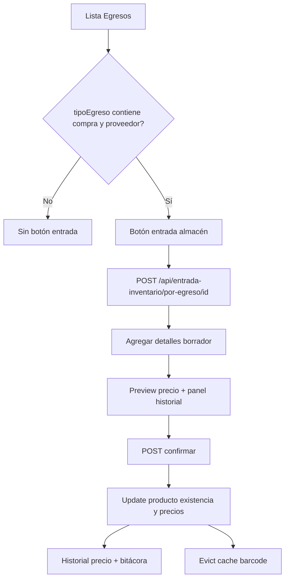

# Entradas de almacén — contexto de desarrollo

**Última actualización:** 2026-05-30  
**Propósito:** Handoff para que cualquier IA (o desarrollador) retome el módulo de **entradas de inventario manual** vinculadas a **egresos**, incluyendo historial de precios, UI Angular y backend Java.

---

## 1. Resumen funcional

Flujo de negocio:

1. En **Financiero → Egresos** (`/apps/financiero/egresos`) el usuario ve egresos paginados (`GET /egresos/search`).
2. Solo algunos egresos muestran el botón **entrada almacén** (ver §5).
3. Al abrir la entrada (`/apps/financiero/egresos/:egresoId/entrada-inventario`):
   - Se crea o recupera un borrador `entrada_inventario` (1:1 con `egreso_id`).
   - Se buscan productos por barcode/nombre, se agregan líneas con cantidad, precio compra y precio venta.
   - Panel derecho: ajustes de precio venta (util `ajustar-precio-venta.util.ts`).
   - Panel izquierdo (45%): historial de precios del producto seleccionado.
4. Al **confirmar**:
   - Suma `existencia` en `producto`.
   - Actualiza `precio_compra` y opcionalmente `precio` (venta).
   - Si cambian compra/venta → insert en `historial_precio_producto` + bitácora `ENTRADA_INV_PRECIO`.
   - Invalida caché de producto por barcode (`evictProductCacheByBarcode`).

Estados de entrada: `BORRADOR` | `CONFIRMADA` | `ANULADA`.

---

## 2. Repositorios y entorno

| Componente | Repo / ruta | Notas |
|---|---|---|
| Frontend | `infinito-ai-front` | Angular 17, standalone components |
| Backend | `pos-relational-data-service` | Spring Boot, puerto **8088** |
| Base de datos | PostgreSQL `controlneg_rmx_db` | localhost:5432 |
| API relacional | `environment.apiUrlRelationalDb` | ej. `http://localhost:8088` |

**Producto de prueba:** CHOCOCONO — barcode `7702402054416`, id **656**.

---

## 3. Base de datos

### 3.1 Scripts SQL (ejecutar en orden)

Ubicación backend:

```
pos-relational-data-service/src/main/resources/doc/contextos/database/
├── entrada_inventario.sql          # Tablas entrada + columna existencia en producto
├── historial_precio_producto.sql   # Historial precios + eventos bitácora
└── historial_precio_producto_seed_chococono.sql  # Seed demo 6 cambios CHOCOCONO
```

### 3.2 Tablas principales

**`producto`** — columna agregada:

```sql
ALTER TABLE producto ADD COLUMN IF NOT EXISTS existencia INTEGER NOT NULL DEFAULT 0;
```

**`entrada_inventario`** — una entrada por egreso (`egreso_id UNIQUE`):

- `estado`: BORRADOR | CONFIRMADA | ANULADA
- `total_items`, `fecha_creacion`, `fecha_confirmacion`, `usuario_id`, `observaciones`

**`entrada_inventario_detalle`** — líneas del borrador:

- `producto_id`, `cantidad`, `precio_compra_registrado`, `precio_compra_anterior`
- `precio_venta_actual`, `precio_venta_nuevo`, `porcentaje_ganancia_calc`
- `porcentaje_variacion_compra`, `alerta_precio_subio`

**`historial_precio_producto`** — snapshot al confirmar si cambió compra o venta:

- FK `entrada_inventario_detalle_id` ON DELETE CASCADE
- `precio_compra`, `precio_compra_antes`, `precio_venta`, `precio_venta_antes`
- `porcentaje_ganancia`, `porcentaje_ganancia_antes`

### 3.3 Documentación previa

Snapshot del estado de BD **antes** de inventario:

`pos-relational-data-service/.../basedatos-antes-dbflux-y-entradas-inventario.md`

---

## 4. Backend (Java)

### 4.1 Paquete base

```
com.infinitesoft.pos_relational_data_service
├── controllers/
│   ├── EntradaInventarioController.java      → /api/entrada-inventario
│   └── HistorialPrecioProductoController.java → /api/historial-precio-producto
├── services/
│   ├── EntradaInventarioService.java
│   ├── impl/EntradaInventarioServiceImpl.java   ★ lógica principal
│   ├── HistorialPrecioProductoService.java
│   └── impl/HistorialPrecioProductoServiceImpl.java
├── entities/
│   ├── EntradaInventario.java
│   ├── EntradaInventarioDetalle.java
│   ├── HistorialPrecioProducto.java
│   └── enums/EntradaInventarioEstado.java
├── repositories/
│   ├── EntradaInventarioRepository.java
│   ├── EntradaInventarioDetalleRepository.java
│   └── HistorialPrecioProductoRepository.java
└── dto/
    ├── EntradaInventarioDetalleRequest.java
    └── EntradaInventarioEstadoResumenDto.java
```

### 4.2 API REST — Entrada inventario

Base: `GET|POST /api/entrada-inventario`  
Roles: `admin`, `cajero`, `invitado`

| Método | Ruta | Descripción |
|---|---|---|
| POST | `/por-egreso/{egresoId}` | Obtener o crear borrador |
| GET | `/por-egreso/{egresoId}` | Buscar por egreso |
| GET | `/resumen?egresoIds=1,2,3` | Resumen estado para lista egresos |
| GET | `/preview-precio?productoId=&precioCompra=` | Preview variación/ganancia |
| POST | `/{entradaId}/detalle` | Agregar línea |
| PUT | `/{entradaId}/detalle/{detalleId}` | Actualizar línea |
| DELETE | `/{entradaId}/detalle/{detalleId}` | Eliminar línea |
| POST | `/{entradaId}/confirmar` | Aplicar a producto + historial |
| POST | `/{entradaId}/anular` | Anular borrador |

### 4.3 API REST — Historial precios

| Método | Ruta | Descripción |
|---|---|---|
| GET | `/api/historial-precio-producto/producto/{productoId}` | Lista DESC por fecha |

### 4.4 Confirmación — `EntradaInventarioServiceImpl.aplicarDetalleAProducto()`

Por cada detalle al confirmar:

1. `producto.precio_compra` ← precio registrado en línea.
2. `producto.precio` ← `precio_venta_nuevo` si viene en detalle.
3. `producto.existencia` += cantidad.
4. Recalcula `% ganancia` vía `productRepository.actualizarPorcentajeGanancia`.
5. **`productService.evictProductCacheByBarcode(barcode)`** — crítico (ver §6).
6. Si cambió compra o venta → `historial_precio_producto` + bitácora evento `ENTRADA_INV_PRECIO`.
7. Siempre → `historial_producto` evento `"entrada inventario"`.

### 4.5 Egresos (relacionado)

- Lista: `GET /egresos/search?page=&size=`
- Detalle: `GET /egresos/{id}` — usado en frontend para validar tipo antes de abrir entrada.

---

## 5. Regla de elegibilidad — solo ciertos egresos

**Entrada almacén solo si** `proveedor.tipoEgreso.nombre` contiene **"compra"** y **"proveedor"** (case-insensitive).

Ejemplo válido: `"Compra proveedor de producto"`.

**Frontend:**

```typescript
// infinito-ai-front/.../egresos/util/egreso-permite-entrada-inventario.util.ts
export function egresoPermiteEntradaInventario(egreso): boolean {
  const nombre = egreso?.proveedor?.tipoEgreso?.nombre?.toLowerCase() ?? '';
  return nombre.includes('compra') && nombre.includes('proveedor');
}
```

**Dónde se aplica:**

| Ubicación | Comportamiento |
|---|---|
| `egreso-list.component.html` | Botón entrada solo si `permiteEntradaInventario(egreso)` |
| `egreso-list.component.ts` | `cargarResumenEntradas()` filtra ids elegibles |
| `entrada-inventario.component.ts` | `validarEgresoYLoadEntrada()` → redirect si no aplica |

**Pendiente backend (opcional):** validar mismo criterio en `obtenerOCrearPorEgreso` para evitar bypass por API directa.

---

## 6. Bug crítico resuelto — caché de productos

**Problema:** Tras confirmar entrada, `GET /products/search-by-barcode` devolvía precios viejos porque usa `@Cacheable` y el save no invalidaba caché.

**Fix:**

- `ProductService.evictProductCacheByBarcode(String barcode)`
- Clave caché normalizada a **mayúsculas**: `#barcode.toUpperCase()`
- Llamada en `EntradaInventarioServiceImpl` tras `productRepository.save()`

**Importante:** Tras desplegar fix, **reiniciar backend** para limpiar caché en memoria.

`POST /products/busquedaPorFiltros` **no** usa caché (por eso ahí sí se veían precios nuevos).

---

## 7. Frontend (Angular)

### 7.1 Rutas

```typescript
// app.routes.ts — bajo /apps/financiero
{ path: 'egresos', ... data: { scrollDisabled: true } }
{ path: 'egresos/:egresoId/entrada-inventario', ... data: { scrollDisabled: true } }
```

### 7.2 Archivos clave

```
infinito-ai-front/src/app/pages/apps/financiero/
├── egresos/
│   ├── egreso-list/                    # Lista + botón entrada
│   ├── service/egresos.service.ts      # + getEgresoById()
│   └── util/egreso-permite-entrada-inventario.util.ts
└── entrada-inventario/
    ├── entrada-inventario.component.{ts,html,scss}
    ├── service/
    │   ├── entrada-inventario.service.ts
    │   └── historial-precio-producto.service.ts
    └── util/
        └── ajustar-precio-venta.util.ts   # Reglas ajuste precio venta
```

### 7.3 Layout pantalla entrada

- **Card principal:** formulario búsqueda producto + tabla líneas del borrador.
- **Panel comparativa** (split ~55% derecha / 45% historial):
  - **Historial (45%):** resumen “Último cambio”, gráfico barras + eje fechas, paginación 3 en 3.
  - **Ajustes (55%):** “Precio venta actual”, filas Ingreso / Actual / Diferencia con botones ajuste.

### 7.4 UI — Gráfico historial (`historial-vista`)

Diseño unificado barra + eje en columnas (`historialVistaColumnas`):

| Siempre visible | Solo en hover sobre columna |
|---|---|
| Barras apiladas (naranja=compra, verde=margen/venta) | Panel flotante: diff días, compra, venta, ganancia |
| Precio venta completo arriba (`formatCurrency`) | — |
| Badge flecha + delta venta vs cambio anterior (`formatDeltaPesosResumen`) | — |
| Fecha en eje horizontal (punto + fecha corta) | — |

**Resumen “Último cambio”:**

- Iconos: `local_shipping` (compra, naranja), `shopping_cart` (venta, verde).
- Compara penúltima → última modificación con variación en pesos y %.

**Paginación gráfico:**

- `historialVistaTamano = 3`
- Página 0 = últimos 3 cambios (ventana anclada al final del historial).
- Flechas ◀ ▶ en header del panel.

### 7.5 Ajuste automático precio venta

Archivo: `util/ajustar-precio-venta.util.ts`

- Umbral ganancia: **50%** (`UMBRAL_GANANCIA_AJUSTE`).
- Si ganancia nueva < 50%: mantener % ganancia actual.
- Si ≥ 50%: venta + (delta compra × 1.05), redondeo comercial a múltiplos de $100.

### 7.6 Scroll en vista fija

Rutas con `scrollDisabled: true`. Patrón flex + `height: 0` + `overflow-y: auto` en cuerpo del card.

Referencia: `.cursor/rules/table-viewport-adjustment.mdc`

### 7.7 Bugs frontend corregidos en sesión

| Bug | Fix |
|---|---|
| Limpiar producto (X) + pegar barcode no buscaba | `suppressSearch = false` en `limpiarProducto()` |
| Paginación gráfico última página con 1 barra | Ventana anclada al final (`historialPaginaInicio`) |
| Barras invisibles tras unificar layout | `historial-vista__bar` flex column + `bar-wrap` height 100% |
| Precios barcode obsoletos post-confirmar | Backend caché (§6) |

---

## 8. Diagrama de flujo



---

## 9. Checklist para retomar desarrollo

### Verificar entorno

- [ ] PostgreSQL: tablas `entrada_inventario*`, `historial_precio_producto`, `producto.existencia`
- [ ] Backend `:8088` corriendo
- [ ] Frontend `:4200` con `apiUrlRelationalDb` correcto

### Probar flujo mínimo

1. Egreso tipo “Compra proveedor de producto” → botón camión visible.
2. Agregar CHOCOCONO por barcode `7702402054416`.
3. Confirmar → `existencia` sube, precios actualizados.
4. Historial panel muestra barras y “Último cambio”.
5. Buscar mismo producto por barcode → precios coinciden con BD.

### Posibles mejoras (no implementadas)

- Validación tipo egreso en backend al crear entrada.
- Anular/revertir entrada confirmada (hoy no se puede).
- OCR / escaneo soporte compra (mencionado en doc BD previa).
- Tests e2e del gráfico historial y confirmación.
- Commit/PR formal del feature (no se hizo en sesión original).

---

## 10. Índice rápido de endpoints usados por el frontend

```
GET  /egresos/search
GET  /egresos/{id}
POST /api/entrada-inventario/por-egreso/{egresoId}
GET  /api/entrada-inventario/resumen?egresoIds=
GET  /api/entrada-inventario/preview-precio
POST /api/entrada-inventario/{id}/detalle
DELETE /api/entrada-inventario/{id}/detalle/{detalleId}
POST /api/entrada-inventario/{id}/confirmar
GET  /api/historial-precio-producto/producto/{productoId}
GET  /products/search-by-barcode?barcode=     (cacheado)
POST /products/busquedaPorFiltros?query=     (sin caché)
```

---

## 11. Convenciones para IAs que continúen

1. **Minimizar scope** — no refactorizar egresos/ingresos al tocar entradas.
2. **Reutilizar** `egresoPermiteEntradaInventario()` para cualquier nueva UI de acceso.
3. **Precios COP:** `formatCurrency` / `Intl es-CO`; deltas con signo `+` / `−`.
4. **Tras cambios en confirmación de producto:** siempre considerar invalidación caché barcode.
5. **Scroll:** respetar `scrollDisabled` y patrón flex del proyecto.
6. **SQL:** scripts idempotentes con `IF NOT EXISTS` en carpeta `doc/contextos/database/`.

---

*Documento generado como handoff de sesión de desarrollo — entradas de almacén vinculadas a egresos, historial de precios y UI de comparativa.*
