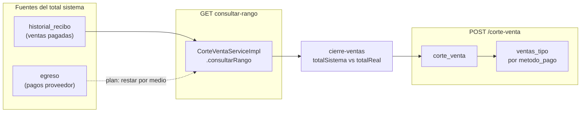

# Finanzas — egresos, resumen económico y control interno (planeación)

**Documento maestro:** [`POS-PLAN-MAESTRO.md`](./POS-PLAN-MAESTRO.md) · **Estado:** **APROBADO** (2026-06-06) — incluye pg_dump y arqueo extendido.

**Última actualización:** 2026-06-06  
**Relacionado:** [`ventas-trazabilidad-dian-plan.md`](./ventas-trazabilidad-dian-plan.md), [`inventario-planificacion.md`](./inventario-planificacion.md), [`entradas-almacen.md`](./entradas-almacen.md).

> Persona natural **NO responsable de IVA**. El módulo financiero del POS es **control interno y ayuda gerencial**, no libro contable oficial ni declaración de renta.

### Principio de comunicación (acordado 2026-06-04)

**Labels, tirillas, pantallas e impresos** deben describir **solo lo que hace este POS**:

| Sí usar | No usar en UI / tirillas |
|---------|---------------------------|
| Comprobante de venta POS | Factura electrónica, CUFE, “documento DIAN” |
| Arqueo / cierre por medio de pago | Certificado tributario, libro oficial |
| Ayuda gerencial, control interno | “Válido ante la DIAN”, “utilidad fiscal” |
| Régimen: no responsable de IVA *(si aplica en cabecera)* | Resolución FE, numeración DIAN |

Las secciones que mencionan DIAN en este documento son **contexto de riesgo / alcance**, no textos para copiar al producto. Ver §3.5 y [`ventas-trazabilidad-dian-plan.md`](./ventas-trazabilidad-dian-plan.md) para impresión de recibos.

---

## 1. Qué hace el sistema hoy

### Egresos (`Egreso` + `/apps/financiero/egresos`)

| Campo | Uso |
|-------|-----|
| `fecha`, `valor`, `descripcion` | Salida de dinero del negocio |
| `proveedor` → `tipoEgreso` | Clasificación (ej. compra proveedor → entrada almacén) |

No hay hoy: consecutivo de egreso, soporte escaneado, vínculo obligatorio a factura proveedor (salvo flujo entrada inventario vía egreso).

### “Ingresos” en la práctica del POS

| Módulo UI | Fuente real en BD |
|-----------|-------------------|
| Ventas / tickets | `historial_recibo` al pagar |
| `/apps/financiero/ingresos` | **`corte_venta`** (cierre por usuario/rango), no tabla `ingreso` |
| Resumen económico | `EstadisticaFinancieraService`: **Σ corte_venta.total** − **Σ egreso.valor** |

```text
resultado_operativo (estadistica_fin) = totalVentas (cortes) − totalEgresos (egresos por fecha)
```

**Importante:** un recibo pagado y un corte de venta no son lo mismo; el resumen usa **cortes**, no cada `historial_recibo` directo. Anulaciones/NC planificadas deben alinear cortes o `documento_venta`.

---

## 2. ¿La DIAN exige esto en el POS?

### Lo que sí encaja con revisión / buenas prácticas (ya en plan o pendiente)

| Tema | En POS | Notas |
|------|--------|-------|
| Trazabilidad **ventas** | `historial_recibo` + plan `documento_venta` | Tirilla, consecutivo, NC/ND |
| Trazabilidad **inventario** | Plan kardex + entradas almacén | Libro auxiliar cantidades |
| Identificación del obligado | Plan `establecimiento` | NIT, régimen en tirilla |
| No borrar, auditar cambios | `bitacora_usuario`, historiales | Reforzar en egresos |
| Respaldo de información | `CopiasSeguridad` + plan BD (§8) | Retención años |

### Lo que la DIAN **no** suele exigir que haga este POS (persona natural no RIVA)

| Tema | Por qué |
|------|---------|
| **Utilidad fiscal / renta** | Declaración de renta con contador |
| **Libro contable oficial** | POS ≠ software contable |
| **Egresos deducibles** | Requiere soporte y criterio contable |
| **Conciliación bancaria completa** | Rol tesorería/contabilidad |

**Conclusión:** el resumen ventas − egresos es **ayuda gerencial**, no reporte tributario.

---

## 3. Renombre y aclaraciones — ayuda gerencial (plan ejecución UI)

### 3.1 Mapa de renombres (obligatorio al ejecutar)

| Ubicación actual | Texto actual | Texto planificado |
|------------------|--------------|-------------------|
| `financiero.component` tab | Resumen económico | **Resumen económico** *(mantener título)* |
| Subtítulo / banner tab | — | **Ayuda gerencial — no es utilidad fiscal** |
| `resumen-economico-list` `<h2>` | Resumen económico | **Resumen económico (ayuda gerencial)** |
| Columna tabla | Utilidad | **Resultado operativo** |
| Columna tabla | % utilidad | **% sobre ventas** |
| Footer | Total utilidad | **Total resultado operativo** |
| Footer | % utilidad | **% sobre ventas (aprox.)** |
| `utilidad-edit` diálogo | *(revisar título)* | **Ajustar periodo — resumen operativo** |
| Tooltips / hints | — | Ver §3.3 |

**Backend DTOs:** mantener campos `utilidad` / `porcentajeUtilidad` en JSON **por compatibilidad**; el front muestra labels nuevos. Opcional alias en API v2: `resultadoOperativo`.

### 3.2 Disclaimer fijo (copiar literal en ejecución)

**Banner** en `resumen-economico-list` (debajo del título, `mat-card` info, siempre visible):

```text
Resumen de ayuda gerencial. Calcula ventas registradas en cortes del POS menos egresos
anotados en el sistema. No sustituye contabilidad, libros oficiales ni declaración de
renta. Un egreso aquí no implica gasto deducible sin soporte y criterio de un contador.
```

**Pie de tabla** (texto secundario 11px):

```text
Cifras aproximadas para decisiones del día a día. Para obligaciones tributarias consulte
a su contador con soportes y libros del periodo.
```

**Mismas leyendas** en export Excel/PDF del resumen (cuando exista).

### 3.3 Tooltips por columna (plan)

| Columna | Tooltip |
|---------|---------|
| Ventas / total ventas | Suma de **cortes de venta** del periodo en el POS, no ingresos contables. |
| Egresos | Salidas registradas en Financiero → Egresos. |
| Resultado operativo | Ventas del POS − egresos registrados; **margen aproximado**. |
| % sobre ventas | Porcentaje del resultado operativo sobre ventas del POS. |

### 3.4 Etiquetas en links de navegación (plan front)

Objetivo: el usuario ve **qué es gerencial/admin** antes de entrar.

| Ruta | Label menú | Badge / subtítulo planificado |
|------|------------|-------------------------------|
| `/apps/financiero` | Financiero | Chip secundario: **Gerencial** |
| `./ingresos` | Ingresos | **Cortes de venta** |
| `./egresos` | Egresos | **Salidas de caja** |
| `./proveedores` | Proveedores | *(sin badge)* |
| `./resumen-economico` | Resumen económico | **Ayuda gerencial** (color info) |
| `/apps/financiero/egresos/.../entrada-inventario` | *(desde egreso)* | **Operativo** |
| Copias seguridad *(si hay menú)* | Backup | **Solo admin · BD** |

Implementación sugerida: extender `NavigationItem` con `badge?: string` y `rolesRequeridos?: string[]`; en `financiero.component` `links[]` con badges; filtrar por roles (§4).

### 3.5 Tirillas y documentos impresos (plan)

Alineado a POS **no RIVA** — textos en `recibo-print.service.ts`, tirilla de cierre/arqueo y export Excel:

| Documento | Encabezado / pie planificado |
|-----------|------------------------------|
| Recibo venta | **Comprobante de venta** · nombre establecimiento · NIT · *No responsable de IVA* |
| Arqueo / cierre | **Cierre de turno — medios de pago** · periodo · desfase por medio · *Control interno del POS* |
| Resumen export | Misma leyenda §3.2 en primera fila o pie |

**Evitar:** logos o frases que impliquen facturación electrónica. Consecutivo interno del POS (ej. recibo # / corte #), no numeración de resolución DIAN.

---

## 4. Roles — seguridad, multi-rol y establecimiento unipersonal

### 4.1 Estado actual

| Repo | Esquema / tablas |
|------|------------------|
| **infinito-security** | `security.usuario`, `security.roles`, `security.usuario_roles` |
| Conexión | `jdbc:postgresql://localhost:5432/controlneg_rmx_db?currentSchema=security` (`application.properties`) |
| Roles seed | `admin`, `cajero`, `invitado` |
| Front | JWT → `localStorage` `user-roles`; `AuthService.isAdmin()` |
| Backend POS | Casi todo `@PreAuthorize("hasAnyRole('admin','cajero','invitado')")`; backup **`hasRole('admin')`** |

**Un usuario puede tener varios roles** (`usuario_roles` PK compuesta). En tiendas donde **una sola persona** atiende todo, asignar **`admin` + `cajero`** (y quitar `invitado` si no aplica).

Regla planificada:

```text
Permiso efectivo = UNIÓN de permisos de todos los roles del usuario (OR).
```

No exigir “solo un rol”; la UI muestra unión de menús permitidos.

### 4.2 Roles sugeridos (evolución)

| Sigla | Nombre | Uso |
|-------|--------|-----|
| `admin` | Administrador | Todo + backup BD + gestión usuarios |
| `cajero` | Cajero | Tickets, cobro, historial ventas, productos consulta |
| `invitado` | Invitado | Demo / cotización limitada (existente) |
| `dueno` *(opcional)* | Dueño | Igual admin en POS pequeño; alias documental |
| `contador` *(opcional fase 2)* | Contador (solo lectura) | Export resumen, documentos, sin editar egresos |

**Fase 1:** no crear roles nuevos en BD; usar matriz **funcionalidad × rol** con `admin`, `cajero`, `invitado` solamente.

### 4.3 Tablas planificadas en BD negocio (`public`) — permisos de pantalla

Catálogo desacoplado del JWT; referencia `roles.sigla` del esquema `security` **por texto** (sin FK cross-schema obligatoria).

```sql
-- Plan: pos-relational-data-service/.../database/05_funcionalidad_pos.sql

funcionalidad_pos (
    id              SERIAL PRIMARY KEY,
    codigo          VARCHAR(50) UNIQUE NOT NULL,  -- RESUMEN_ECONOMICO, EGRESOS, ...
    nombre          VARCHAR(100) NOT NULL,
    seccion         VARCHAR(50),                  -- FINANCIERO, VENTAS, ADMIN
    ruta_front      VARCHAR(200),                 -- /apps/financiero/resumen-economico
    etiqueta_menu   VARCHAR(100),
    badge_ui        VARCHAR(40),                  -- 'Ayuda gerencial'
    requiere_disclaimer BOOLEAN DEFAULT FALSE,
    activo          BOOLEAN DEFAULT TRUE
)

funcionalidad_rol (
    funcionalidad_id INTEGER NOT NULL REFERENCES funcionalidad_pos(id),
    rol_sigla        VARCHAR(50) NOT NULL,        -- admin | cajero | invitado
    puede_leer       BOOLEAN DEFAULT TRUE,
    puede_escribir   BOOLEAN DEFAULT FALSE,
    PRIMARY KEY (funcionalidad_id, rol_sigla)
)
```

**Seeds planificados (extracto):**

| codigo | rol_sigla | leer | escribir |
|--------|-----------|------|----------|
| TICKETS | cajero, admin | ✓ | ✓ |
| HISTORIAL_VENTAS | cajero, admin | ✓ | ✓ |
| EGRESOS | admin | ✓ | ✓ |
| RESUMEN_ECONOMICO | admin | ✓ | ✓ (solo lectura basta) |
| ENTRADA_ALMACEN | admin, cajero | ✓ | ✓ |
| BACKUP_BD | admin | ✓ | ✓ |
| GESTION_USUARIOS | admin | ✓ | ✓ |
| ANULAR_VENTA | admin | ✓ | ✓ |
| RESTAURAR_TICKET | admin | ✓ | ✓ |

**API planificada:** `GET /api/funcionalidades/mis-permisos` → lista códigos según roles del JWT (backend valida con `security` vía token).

**Backend endpoints sensibles:** reemplazar gradualmente `hasAnyRole('admin','cajero','invitado')` por `@PreAuthorize` alineado a funcionalidad (ej. egresos solo `admin`).

### 4.4 Frontend (plan ejecución)

| Tarea | Detalle |
|-------|---------|
| `NavigationLoaderService` | Filtrar ítems por `mis-permisos` o por roles locales |
| `financiero.component` `links` | Ocultar Resumen/Egresos si no hay permiso; mostrar badge |
| Guard rutas | `canActivate` con roles o códigos funcionalidad |
| Toolbar usuario | Mostrar roles: `Admin · Cajero` si varios |
| Establecimiento 1 persona | Documentar en ayuda: asignar admin+cajero al mismo `usuario_id` |

### 4.5 Gestión usuarios existente

- Front: `/apps/gestion-usuarios` + `AuthService.actualizarRolesUsuario` → `PUT /auth/actualizar-roles-usuarios` (infinito-security).
- Al ejecutar plan: UI para asignar **múltiples roles** con checkboxes (admin + cajero).

---

## 5. Backup — nivel base de datos (plan ampliado)

Hoy: **`CopiasSeguridadController`** — Excel vía app (`hasRole('admin')`), esquemas `public` + datos de negocio. **No sustituye** backup nativo PostgreSQL.

### 5.1 Capas de respaldo planificadas

| Capa | Herramienta | Alcance | Frecuencia sugerida |
|------|-------------|---------|---------------------|
| **A — Lógico PG** | `pg_dump` / `pg_restore` | BD completa `controlneg_rmx_db` (schemas `public` + `security`) | Diario automatizado |
| **B — App Excel** | `GET /copias-seguridad/generar-backup` | Export legible, restauración incremental | Semanal / antes cambios |
| **C — WAL / PITR** | PostgreSQL archiving *(opcional)* | Recuperación punto en el tiempo | Producción seria |
| **D — Offsite** | Copia cifrada a disco/nube | Retención legal | Mensual |

### 5.2 Tablas / metadatos planificados (`public`)

```sql
backup_registro (
    id BIGSERIAL PRIMARY KEY,
    tipo                VARCHAR(20),   -- PG_DUMP | EXCEL_APP | MANUAL
    archivo_nombre      VARCHAR(500),
    archivo_hash_sha256 VARCHAR(64),
    tamano_bytes        BIGINT,
    esquemas_incluidos  VARCHAR(200),  -- public,security
    usuario_id          UUID,
    fecha_inicio        TIMESTAMP,
    fecha_fin           TIMESTAMP,
    estado              VARCHAR(20),   -- OK | ERROR
    observaciones       TEXT,
    retencion_hasta     DATE           -- política 5–10 años configurable
)

configuracion_backup (
    clave VARCHAR(50) PRIMARY KEY,
    valor_json JSONB
)
```

**Política planificada:** ver §5.5 — datos operativos en BD **sin límite de tiempo** (hoy ya es así); para **archivos de backup** recomendar conservar **al menos 5 años** (configurable), sin borrar kardex / ventas históricas por purge automático.

### 5.5 Qué es «retención» (concepto — acordado en planeación)

**Retención** aquí **no** es retención en la fuente (impuesto). Es **cuánto tiempo guardas** copias de respaldo antes de poder eliminarlas.

| Tipo | Qué significa | Estado hoy / plan |
|------|----------------|-------------------|
| **Datos en BD** | Ventas en `historial_recibo`, cortes, egresos, kardex | **Ilimitada** — no hay purge; **mantener así** |
| **Retención de backups** | Cuánto guardar archivos `pg_dump` / Excel | Recomendación **5 años** en `configuracion_backup`; editable por admin |
| **Referencia contable** | Plazo que contador recomienda guardar soportes | Confirmar con contador; el POS no impone borrado de BD |

**Por qué 5 años solo en backups:** margen prudente para archivos en disco/nube; **no obliga** a borrar registros de la base de datos.

**Qué implementar al ejecutar:**

```text
configuracion_backup.retencion_anios = 5   (default, editable por admin)
backup_registro.retencion_hasta = fecha_generacion + retencion_anios
Sin job de DELETE en historial_recibo / corte_venta / egreso
```

**Qué NO es obligatorio hacer el día 1:** archivar en nube 5 años; basta backups periódicos + registro en `backup_registro`.

### 5.6 Backup con `pg_dump` — qué es y cómo se integra (acordado 2026-06-04)

**Sí:** el plan se refiere al **comando oficial de PostgreSQL** `pg_dump`, no a una “copia de datos” hecha fila por fila desde Java como el Excel actual.

| | Excel app (hoy) | `pg_dump` (plan) |
|--|-----------------|------------------|
| **Qué es** | Export hoja por hoja vía API | Volcado lógico **completo** de la BD |
| **Incluye** | Tablas que `BackupService` mapea | **Todo** `public` + `security` (usuarios, roles, ventas, kardex futuro) |
| **Restaurar** | Import incremental Excel | `pg_restore` o `psql` sobre archivo `.dump` / `.sql` |
| **Quién lo ejecuta** | Admin desde UI | Script en servidor **o** botón admin que dispara proceso en backend |
| **Registro** | Parcial | Tabla `backup_registro` con hash, tamaño, `retencion_hasta` |

**Flujo planificado (Capa A):**

```text
1. Admin → menú «Backup base de datos» (solo admin)
2. Backend ejecuta (ProcessBuilder o cron):
     pg_dump -h localhost -U ... -d controlneg_rmx_db -F c -f /backups/pos_20260604.dump
3. Calcula SHA-256 del archivo
4. INSERT backup_registro (tipo=PG_DUMP, estado=OK, usuario_id, retencion_hasta)
5. UI lista backups descargables (opcional) o solo confirma «Backup generado»
```

**Importante:** el Excel (**Capa B**) **se mantiene** como export legible y respaldo complementario; **no reemplaza** `pg_dump` para recuperación total ante desastre.

**Frontend planificado:**

| Pantalla | Contenido |
|----------|-----------|
| Admin → Backup BD | Botón **Generar backup PostgreSQL**; tabla historial desde `backup_registro`; disclaimer §5.4 |
| Copias seguridad Excel | Menú separado — badge **Excel gerencial** |

**Cron opcional:** mismo script diario sin UI; igual registra en `backup_registro`.

### 5.3 Qué falta hoy vs plan

| Ítem | Hoy | Plan |
|------|-----|------|
| Backup PG nativo | No integrado en app | Script + registro en `backup_registro` |
| Backup incluye `security` | Excel parcial según `BackupService` | Verificar y documentar hojas; pg_dump **sí** incluye usuarios/roles |
| Restaurar en entorno prueba | Manual | Procedimiento documentado |
| Cifrado archivos backup | No | Opcional ZIP+password |
| Prueba restore periódica | No | Checklist trimestral |
| Bitácora quién generó backup | Parcial | `backup_registro.usuario_id` |

### 5.4 UI planificada

- Menú **Admin → Backup base de datos** (solo `admin`, badge **BD completa**).
- Separar de “export Excel gerencial”.
- Disclaimer: *“Restaurar backup reemplaza datos; ejecutar solo en ventana autorizada.”*

---

## 6. Arqueo de caja — qué es, qué hay y qué cambiar

### 6.0 Qué es el arqueo (en una frase)

Al **cerrar un periodo de trabajo**, comparar por cada medio de pago (efectivo, Nequi, transferencia…):

```text
Lo que el POS registró  −  lo que pagaste a proveedores  =  lo que DEBERÍAS tener
Lo que TÚ declaras (conteo billetes / saldo en app)      =  lo que REALMENTE tienes
Desfase = declarado − esperado
```

Eso **ya existe** con el nombre **“cierre de ventas”**: pantalla `cierre-ventas` → `POST /corte-venta` → tablas `corte_venta` + `ventas_tipo`.  
**Arqueo** en el plan = mismo concepto, con **mejor nombre en UI**, **egresos por medio**, **fondo inicial** opcional y **vínculo a sesión** — **sin tablas paralelas nuevas**.



**`historial_recibo` no se modifica** para el arqueo: es el registro permanente de ventas cobradas. El arqueo **lee** de ahí (y de egresos); **`recibo` / `ticket_*`** son tablas de trabajo con pocos registros (§6.7).

### 6.1 Qué hay hoy (código real)

| Pieza | Ubicación | Qué hace |
|-------|-----------|----------|
| **Consulta rango** | `CorteVentaServiceImpl.consultarRango` | `fechaIni`/`fechaFin` desde último `corte_venta` o manual; **`findResumenVentasPorMetodoPago`** sobre `historial_recibo` |
| **Registro cierre** | `CorteVentaServiceImpl.createFromDTO` | Guarda `corte_venta` + `ventas_tipo`; si `ultimoCorte && actual`, recalcula `totalSistema` desde rango |
| **UI** | `cierre-ventas.component` | Una fila por `metodo_pago`; `totalSistema` vs `totalReal`; desfase; POST como en tu curl |
| **Estadísticas** | `EstadisticaFinancieraService` | Usa `corte_venta.total` (declarado), no solo sistema |

Ejemplo payload actual (equivalente a tu curl):

```json
{
  "fechaIni": "2026-05-16T09:12:00",
  "fechaFin": "2026-05-17T00:16:00",
  "total": 1345500,
  "totalSistema": 1345500,
  "ultimoCorte": true,
  "actual": false,
  "ventasTipo": [
    { "metodoPagoId": 1, "total": 1079500, "totalSistema": 1079500 },
    { "metodoPagoId": 2, "total": 266000, "totalSistema": 266000 }
  ]
}
```

**Gap hoy:** `totalSistema` = **solo ventas** (`SUM historial_recibo.total`); **no resta egresos** pagados desde caja/Nequi/QR en ese periodo.

### 6.2 Decisión arquitectura BD — extender lo existente (acordado 2026-06-04)

| Opción | Veredicto |
|--------|-----------|
| Crear `arqueo_caja` + `arqueo_caja_medio` + detalle | **Descartada** — duplica `corte_venta` / `ventas_tipo` |
| Modificar `historial_recibo` | **No** — solo lectura para arqueo |
| **Extender `corte_venta` + `ventas_tipo` + `egreso` + `metodo_pago`** | **Elegida** — cambios mínimos |

#### SQL planificado (alter, no tablas nuevas)

```sql
-- corte_venta (existente)
ALTER TABLE corte_venta ADD COLUMN sesion_id BIGINT NULL REFERENCES sesion(id);
ALTER TABLE corte_venta ADD COLUMN fondo_inicial_efectivo NUMERIC(12,2) NULL;
ALTER TABLE corte_venta ADD COLUMN motivo_desfase TEXT NULL;
-- opcional: consecutivo_display VARCHAR(20)  -- 'CORTE-0042'

-- ventas_tipo (existente) — desglose por medio en el cierre
ALTER TABLE ventas_tipo ADD COLUMN total_ventas_sistema NUMERIC(12,2) NULL;
ALTER TABLE ventas_tipo ADD COLUMN total_egresos_sistema NUMERIC(12,2) NULL;
ALTER TABLE ventas_tipo ADD COLUMN desfase NUMERIC(12,2) NULL;
-- total_sistema (existente) = total_ventas_sistema - total_egresos_sistema (+ fondo solo efectivo si aplica)

-- egreso (existente)
ALTER TABLE egreso ADD COLUMN metodo_pago_id BIGINT NULL REFERENCES metodo_pago(id);

-- metodo_pago (existente)
ALTER TABLE metodo_pago ADD COLUMN visible_pagos_egresos BOOLEAN NOT NULL DEFAULT TRUE;
ALTER TABLE metodo_pago ADD COLUMN es_base_proveedores BOOLEAN NOT NULL DEFAULT FALSE;
```

**Migración datos:** copiar `ventas_tipo.total_sistema` → `total_ventas_sistema`; `total_egresos_sistema = 0` en históricos.

### 6.3 Egresos — origen de pago y base proveedores (acordado 2026-06-04)

Los proveedores se pagan con las **mismas fuentes** que las ventas: efectivo de caja, Nequi, QR Bancolombia, etc. Muchos negocios apartan **“base para proveedores”** (efectivo del día anterior solo para compras).

| Campo `metodo_pago` | Uso |
|---------------------|-----|
| `visible_pagos_egresos` | Si `true`, aparece en selector **Origen de pago** al registrar egreso a proveedor |
| `es_base_proveedores` | Si `true`, etiqueta UI **Base proveedores** en ese selector (dinero reservado para compras; no cambia lógica contable, solo clasificación) |

**Regla UI:** selector de origen solo en egresos con proveedor (y tipos que impliquen salida de dinero); filtrar `visible_pagos_egresos = true`.

#### Fórmula `totalSistema` por medio (backend `consultarRango`)

```text
total_ventas_sistema[medio]  = SUM(historial_recibo.total)
                               WHERE metodo_pago_id = medio AND fecha en rango AND pagado

total_egresos_sistema[medio] = SUM(egreso.valor)
                               WHERE metodo_pago_id = medio AND fecha_creacion en rango

total_sistema[medio]         = total_ventas_sistema - total_egresos_sistema
                               + fondo_inicial_efectivo   (solo medio EFECTIVO, si se capturó)

total declarado[medio]       = lo que ingresa el cajero (totalReal en UI)
desfase[medio]               = total declarado - total_sistema
```

#### Cambios frontend (anotar en ejecución)

| Archivo / pantalla | Cambio |
|--------------------|--------|
| `egreso-edit.component` | Campo **Origen de pago** (`metodoPagoId`); lista filtrada por `visible_pagos_egresos`; badge si `es_base_proveedores` |
| `metodo-pago` admin *(si existe CRUD)* | Checkboxes `visible_pagos_egresos`, `es_base_proveedores` |
| `cierre-ventas.component` | Renombrar título; columnas opcionales Ventas / Egresos / Neto sistema; disclaimer §3.5 |
| `corte-venta.service.ts` | DTO ampliado con `totalVentasSistema`, `totalEgresosSistema` por fila |
| Tirilla cierre *(nueva o ampliar)* | Impresión por medio con desfase; texto §3.5 |

#### Cambios backend (anotar en ejecución)

| Clase | Cambio |
|-------|--------|
| `CorteVentaServiceImpl.consultarRango` | Query egresos por `metodo_pago_id` en rango; neto en respuesta |
| `CorteVentaServiceImpl.createFromDTO` | Persistir columnas nuevas en `ventas_tipo`; opcional `sesion_id` |
| `Egreso` / `EgresoServiceImpl` | Validar `metodo_pago_id` cuando hay proveedor |
| `MetodoPago` entity + DTO | Nuevos flags |
| `HistorialReciboRepository` | Sin cambios estructurales |

### 6.4 Medios digitales en el arqueo (Nequi, transferencia)

**Acordado:** todos los `metodo_pago` activos entran al cierre — efectivo = conteo billetes; digital = saldo/total verificado en app.

**Labels UI (sin referencia DIAN):**

```text
Cierre de turno — medios de pago (control interno).
Efectivo: cuente billetes y monedas.
Nequi / transferencia: indique el total recibido según su aplicación.
```

### 6.5 ¿Finalizar arqueo implica cerrar sesión?

**Recomendación planificada:** **sí, como buena práctica — no bloqueo obligatorio.**

| Comportamiento | Detalle |
|----------------|---------|
| Tras `POST /corte-venta` OK | Diálogo: *“Cierre registrado. Se recomienda **finalizar sesión** para cerrar el turno y respaldar este arqueo.”* + botón **Finalizar sesión** / **Continuar** |
| Vínculo opcional | `corte_venta.sesion_id` = sesión activa al registrar |
| No forzar | Permitir otro corte parcial o seguir vendiendo (negocio unipersonal) |
| Cierre sesión | Flujo existente: `SesionServiceImpl` soft-delete (`es_activo = false`, `fecha_fin`) |

No exigir cierre de sesión para guardar el corte; solo **recomendar** y guardar relación si hay sesión activa.

### 6.6 Roles arqueo

| Acción | admin | cajero |
|--------|-------|--------|
| Registrar cierre / arqueo | ✓ | ✓ |
| Anular corte cerrado | ✓ | ✗ |
| Ver histórico cortes | ✓ | propios |

### 6.7 Tablas ticket / recibo vs historial — ¿problema en revisión?

Flujo al pagar (`ReciboController.update` → `ReciboServiceImpl.update`):

```text
ticket + ticket_detalle  →  recibo + recibo_detalle  (en proceso)
       ↓ PAGADO
historial_recibo + historial_recibo_detalle  (permanente)
recibo / detalle se eliminan o desvinculan
```

| Pregunta | Respuesta |
|----------|-----------|
| ¿Por qué dos capas? | **Rendimiento y claridad:** pocas filas en `recibo`; historial completo e inmutable |
| ¿Objetable para no RIVA? | **No** por el diseño de tablas; la autoridad mira **soportes y totales**, no nombres de tablas |
| ¿Riesgo real? | Borrar o alterar `historial_recibo`; huecos de consecutivos sin NC; no tener backup |
| ¿Acción plan? | Mantener patrón; reforzar que **consultas financieras y arqueo lean `historial_recibo`**, no `recibo` vivo |

### 6.8 Prioridad de implementación

| Fase | Alcance |
|------|---------|
| **A** | Labels §3 + renombrar cierre-ventas + disclaimers §3.5 / §6.4 |
| **B** | `egreso.metodo_pago_id` + flags `metodo_pago` + UI egreso origen de pago |
| **C** | `consultarRango` resta egresos; columnas `ventas_tipo`; UI columnas ventas/egresos/neto |
| **D** | `corte_venta.sesion_id`, fondo inicial efectivo, mensaje post-cierre + tirilla impresión |
| **E** | Motivo desfase obligatorio si \|desfase\| > umbral |

---

## 7. Otros aspectos que aún faltan (lista ampliada)

Además de inventario, ventas documentadas, labels y roles:

| # | Aspecto | Notas |
|---|---------|-------|
| 1 | Política de **retención** documentada | §5.5 — no borrar datos/backups antes de X años |
| 2 | **Export contador** (solo lectura) | CSV ventas/NC/egresos/kardex |
| 3 | **Bitácora egresos** create/update/delete | Quién, cuándo, antes/después |
| 4 | **Horodatamiento servidor** confiable | Fecha hecho vs fecha registro |
| 5 | **Sincronización reloj** / NTP en servidor POS | Evitar tirillas con hora errada |
| 6 | **Inmutabilidad** post-cierre | Bloquear edición egreso de periodo cerrado |
| 7 | **Periodo cerrado contable** *(opcional)* | Flag mes cerrado; solo admin reopen |
| 8 | **Proveedor + soporte** en egreso compra | Ref. factura proveedor |
| 9 | **Separación invitado** vs operación real | Restringir financiero a invitado |
| 10 | **Prueba de restauración backup** | Trimestral |
| 11 | **Manual operativo** dueño | Base: [`guia-conceptos-pos-cajero.md`](./guia-conceptos-pos-cajero.md) — exportar o acortar para tienda |
| 12 | **Términos en login** | Aceptación uso interno POS |
| 13 | **Logs de seguridad** | Intentos fallidos, cambios roles |
| 14 | **Inventario vs resumen** | No mezclar valor inventario con resultado operativo |
| 15 | **Alertas desfase caja** | Notificar admin si faltante > X |

---

## 8. Mejoras planificadas — finanzas (resumen técnico)

### 8.1 Egresos

- Consecutivo, soporte, bitácora, `es_deducible_contable` default false.
- **`metodo_pago_id`** obligatorio cuando egreso a proveedor (§6.3).
- Flags **`metodo_pago`:** `visible_pagos_egresos`, `es_base_proveedores`.
- Rol: escritura **solo admin** (cajero lectura opcional).

### 8.2 Resumen económico

- Renombres §3; fuente ventas → `documento_venta` cuando exista.
- Excluir anuladas / NC.

### 8.3 Exportación contador (fase 2)

- Rol `contador` o permiso `EXPORT_CONTADOR` solo lectura.

---

## 9. Checklist ejecución (finanzas + roles + backup + arqueo)

### Labels y disclaimers

- [ ] Renombrar columnas y footers resumen (§3.1)
- [ ] Banner + pie disclaimer (§3.2)
- [ ] Tooltips columnas (§3.3)
- [ ] Badges en links Financiero (§3.4)

### Roles

- [ ] SQL `funcionalidad_pos` + `funcionalidad_rol`
- [ ] API `mis-permisos`
- [ ] Filtrar navegación y guards
- [ ] Endpoints egresos/resumen → `admin` escritura
- [ ] Documentar multi-rol unipersonal (§4.1)
- [ ] Gestión usuarios: multi-checkbox roles

### Backup BD

- [ ] Tabla `backup_registro`
- [ ] Script `pg_dump` programado
- [ ] UI admin separada de Excel
- [ ] Política retención **archivos** 5 años (BD ilimitada §5.5)
- [ ] Procedimiento restore probado

### Arqueo / corte (extender tablas existentes §6.2)

- [ ] Labels cierre-ventas → **Cierre de turno — medios de pago** + §3.5
- [ ] `egreso.metodo_pago_id` + flags `metodo_pago` (§6.3)
- [ ] UI egreso: origen de pago + badge base proveedores
- [ ] `consultarRango`: restar egresos por medio; columnas `ventas_tipo`
- [ ] UI cierre: columnas ventas / egresos / neto (opcional fase C)
- [ ] `corte_venta.sesion_id`, fondo inicial, mensaje post-cierre §6.5
- [ ] Tirilla cierre impresión (textos §3.5)

### Integración otros planes

- [ ] Resumen alineado con NC (`ventas-trazabilidad-dian-plan.md`)
- [ ] Kardex no mezclado con utilidad (`inventario-planificacion.md`)

---

## 10. Índice para otra sesión

0. [`POS-PLAN-MAESTRO.md`](./POS-PLAN-MAESTRO.md) — **leer primero** (sprints, repos, checklist).  
1. [`ventas-trazabilidad-dian-plan.md`](./ventas-trazabilidad-dian-plan.md) — ventas, NC/ND, impresión, tab R.  
2. Este archivo — finanzas, roles, backup BD, arqueo.  
3. [`inventario-planificacion.md`](./inventario-planificacion.md) — kardex.  
4. [`entradas-almacen.md`](./entradas-almacen.md) — implementado.  
5. Seguridad: `infinito-security/.../schema.sql` (`usuario`, `roles`, `usuario_roles`).  
6. **DIAN Ready (no RIVA):** [`ventas-trazabilidad-dian-plan.md`](./ventas-trazabilidad-dian-plan.md) §12.

---

*Planeación aprobada — implementar por sprints en POS-PLAN-MAESTRO.md §7.*
