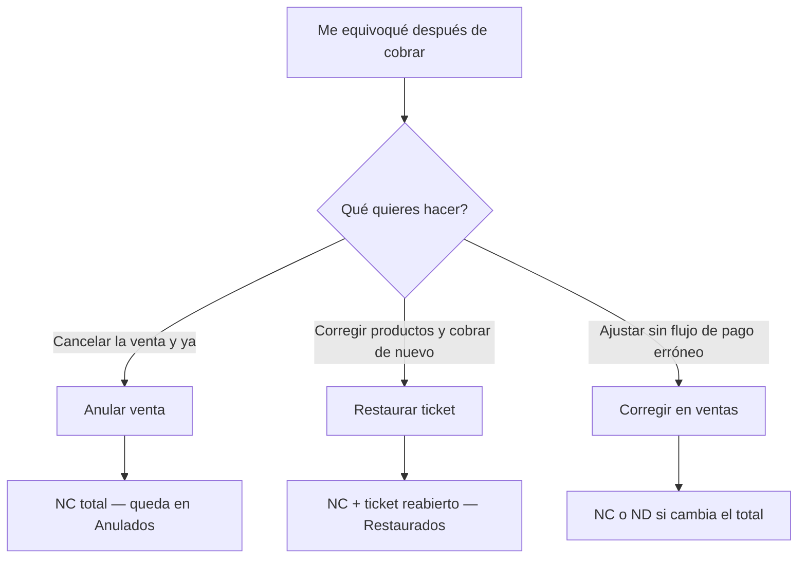

# Guía de conceptos del POS — para cajeros y dueños de tienda

**Documento de diseño orientado al usuario** · Lenguaje sencillo  
**Última actualización:** 2026-06-06  
**Estado del sistema:** parte de lo descrito aquí **ya funciona hoy**; lo marcado como **«próximamente»** entra con el plan aprobado ([`POS-PLAN-MAESTRO.md`](./POS-PLAN-MAESTRO.md)).

**Relacionado (técnico):** [`inventario-planificacion.md`](./inventario-planificacion.md) §3 · [`ventas-trazabilidad-dian-plan.md`](./ventas-trazabilidad-dian-plan.md) · [`finanzas-egresos-resumen-planificacion.md`](./finanzas-egresos-resumen-planificacion.md)

> Este POS es para establecimientos **no responsables de IVA**. Los comprobantes son **control interno de la tienda**, no factura electrónica ni declaración de impuestos.

---

## 1. Para quién es esta guía

| Perfil | Para qué leerla |
|--------|-----------------|
| **Cajero** | Entender pantallas, botones y palabras nuevas (kardex, nota crédito, arqueo…). |
| **Dueño / admin** | Saber qué deja registrado el sistema cuando alguien anula, restaura o cierra caja. |
| **Contador** | Referencia de qué significa cada documento **interno** del POS (no sustituye libros oficiales). |

**No necesitas** saber contabilidad avanzada. Cada concepto trae: **qué es**, **para qué sirve en la tienda** y **qué haces tú en pantalla**.

---

## 2. Idea general del POS

Piensa el POS en **tres cuadernos** que la computadora lleva al día:

```text
┌─────────────────┐  ┌─────────────────┐  ┌─────────────────┐
│  CUADERNO DE    │  │  CUADERNO DE    │  │  CUADERNO DE    │
│  VENTAS         │  │  INVENTARIO     │  │  CAJA / DINERO  │
│  (quién vendió  │  │  (cuánto hay    │  │  (efectivo,     │
│   qué y cuándo) │  │   de cada cosa) │  │   Nequi, etc.)  │
└─────────────────┘  └─────────────────┘  └─────────────────┘
```

Cuando cobras, los tres pueden moverse a la vez: registras la venta, baja el stock *(próximamente en todas las ventas)* y entra dinero según el medio de pago.

---

## 3. Ventas — lo que ya conoces y lo nuevo

### 3.1 Ticket

Es la **venta en curso**: productos en la mesa digital antes de cobrar.

- Agregas productos, cambias cantidades.
- Hasta que no pagas, el ticket puede seguir abierto.

### 3.2 Recibo (al cobrar)

Cuando el cliente paga, el sistema **cierra** esa venta y la guarda en el **historial**. La tirilla que imprimes es un **comprobante de venta del POS**.

**Hoy:** la tirilla muestra productos, total y forma de pago.  
**Próximamente:** también mostrará un número fijo de venta, por ejemplo **`VTA-000042`**, y el nombre legal del negocio (no un texto genérico).

| Nombre en pantalla | Significado |
|--------------------|-------------|
| **VTA-000042** | Número interno de esa venta cerrada. Sirve para buscarla, reimprimirla o explicar un reclamo. |
| Comprobante de venta POS | Documento de la tienda; **no** es factura electrónica. |

### 3.3 Historial de ventas

Ruta: **Ventas → Historial** (`/apps/tickets/historial`).

Ahí ves ventas pasadas. **Próximamente** habrá filtros extra:

| Filtro | Qué muestra |
|--------|-------------|
| **Pagado** | Ventas cerradas y vigentes. |
| **Anulados** | Ventas canceladas con su **nota crédito interna** (ver §4). |
| **Restaurados** | Ventas donde hubo **error de pago** y se usó **Restaurar ticket** (ver §5). |
| **Todos** | Mezcla de lo anterior. |

Al elegir una fila, el panel derecho mostrará **Documentos y operaciones**: número de venta, nota crédito/débito si hubo, quién lo hizo, fecha y motivo.

---

## 4. Nota crédito interna (NC) — «devolver el valor de la venta en el sistema»

### Qué es (sin contabilidad)

Una **nota crédito interna** es un **registro del POS** que dice:

> «Esta venta (VTA-xxx) quedó **reversada** por $X. Motivo: … Quién: … Cuándo: …»

En pantalla verás algo como **`NC-00007`**.  
**No** es un documento de la DIAN ni factura electrónica. Es el **comprobante interno** de que la venta fue corregida o cancelada en el sistema.

### Analogía

Vendiste $10.000 por error. La nota crédito es como un **recibo rojo interno** que deja constancia: «esos $10.000 de esa venta ya no cuentan».

### Cuándo se usa en el nuevo POS

| Situación | ¿Genera NC? |
|-----------|-------------|
| **Anular venta** (desde historial, sin reabrir ticket) | **Sí** — NC por el total. |
| **Restaurar ticket** (pagaste mal y quieres corregir en Ventas) | **Sí** — NC de la venta errónea + se reabre el ticket. |
| **Editar venta** y el total **baja** | **Sí** — NC solo por la **diferencia**. |
| Cobrar normal | No |

### Qué ves tú en Historial → Anulados

- Venta original: **VTA-000042**
- Ajuste: **NC-00007**
- Motivo (ej. «Cliente devolvió todo»)
- Usuario y fecha

Puedes **reimprimir** la tirilla original con una línea que diga que tiene NC asociada *(próximamente)*.

---

## 5. Nota débito interna (ND) — «sumar valor cuando la corrección sube el total»

### Qué es

Lo opuesto de la nota crédito: el POS registra que **aumentó** el valor de una venta ya cerrada.

Ejemplo: cobraste $8.000 pero faltaba un producto de $2.000. Tras editar, el sistema genera **`ND-00003`** por $2.000.

### Cuándo se usa

| Situación | Documento |
|-----------|-----------|
| Editar venta y el total **sube** | **ND** por la diferencia |
| Anular venta | **NC**, no ND |
| Restaurar ticket | **NC** de la venta vieja; al volver a cobrar → **nueva VTA** |

**En el día a día del cajero:** casi siempre verás **NC** (anular o restaurar). La **ND** aparece más en **correcciones de edición** cuando el total aumenta.

---

## 6. Tres formas de corregir un error (muy importante)

Mucha confusión viene de mezclar estos botones. Son **distintos**:



| Botón | Cuándo usarlo | Qué pasa | Dónde lo ves después |
|-------|---------------|----------|----------------------|
| **Anular venta** | La venta no procede; no vas a cobrar de nuevo en ese ticket | NC + venta anulada; stock vuelve *(próximamente)* | Historial → **Anulados** |
| **Restaurar ticket** | Cobraste **por error** (medio de pago mal, ticket equivocado) y quieres **rehacer la venta** | NC + ticket otra vez en Ventas con marca **R** | Historial → **Restaurados** |
| **Corregir en ventas** | Ajuste de ítems/precios con flujo de edición | Puede generar NC/ND por diferencia | Historial → Pagado (con badges) |

**Regla práctica:** si el problema fue «**cerré el pago sin querer**», usa **Restaurar ticket**, no solo Anular.

Al restaurar, el tab del ticket puede mostrar una **«R»** para avisar que es un ticket reabierto.

---

## 7. Inventario — existencia, movimientos y kardex

### 7.1 Existencia (saldo)

Es **cuántas unidades hay hoy** de un producto en la tienda (ej. 24 chocolatinas).

- **Entrada de almacén** (desde un egreso de compra): **ya sube** la existencia.
- **Venta**: **próximamente** bajará la existencia al confirmar el pago.
- **Anular o restaurar**: **próximamente** devolverá unidades al stock.

Solo hay **un número oficial** por producto en el sistema (no dos columnas distintas).

### 7.2 Movimiento de inventario

Es el **acto registrado** de entrada o salida: compra, venta, merma, conteo, etc.

Cada movimiento tiene:

- Tipo (venta, compra, ajuste por conteo…)
- Fecha y responsable
- Líneas por producto y cantidad

**Tú no necesitas** abrir una pantalla «movimiento» en el día a día: el POS lo crea **solo** cuando confirmas entrada de almacén, cobras, anulas, etc.

### 7.3 Kardex (libro auxiliar — inmutable)

#### Qué es

El **kardex** es la **bitácora detallada** de inventario: una lista cronológica que **no se borra**, donde cada línea dice:

| En la línea del kardex | Significado |
|------------------------|-------------|
| Producto | Qué artículo |
| Fecha y hora | Cuándo pasó |
| Entrada (+) | Llegaron unidades (compra, devolución de venta anulada…) |
| Salida (−) | Salieron unidades (venta, merma…) |
| **Saldo después** | Cuánto quedó **después** de ese movimiento |

#### Analogía para el cajero

Imagina un **cuaderno de fila** en la bodega:

```text
Día 1  Compra     +50   → saldo 50
Día 2  Venta      −3    → saldo 47
Día 3  Venta      −1    → saldo 46
Día 4  Anulación  +1    → saldo 47   ← devolviste lo de la venta del día 3
```

Ese cuaderno es el kardex. **No se tachan filas**: si hay error, se agrega otra fila que corrige (por ejemplo reintegro por anulación).

#### Para qué sirve en la tienda

- Saber **cuánto había** en una fecha pasada.
- Explicar diferencias («¿por qué el sistema dice 46?» → se ven las ventas del día).
- Respaldo si el dueño o contador revisan inventario.

#### Qué hace el cajero

En operación normal: **nada extra**. Cobras, confirmas entrada de almacén, anulas — el kardex se llena **automáticamente**.

**Próximamente** el admin podrá ver enlaces a movimientos desde historial **Restaurados**; el cajero no debe editar el kardex a mano.

#### Inmutable = no se borra

- **No** hay botón «eliminar línea de kardex».
- Si anulas una venta, el sistema agrega movimiento de **reintegro**, no borra la venta anterior del kardex.

### 7.4 Entrada de almacén (ya disponible)

Flujo actual:

1. En **Financiero → Egresos** registras que pagaste al proveedor.
2. Botón **entrada almacén** → cargas productos y cantidades.
3. Al **confirmar**, sube existencia y precios.

**Próximamente** esa confirmación también escribirá en el kardex tipo «compra».

### 7.5 Conteo físico *(próximamente)*

Contar lo que hay en anaquel y comparar con el sistema. Si hay diferencia, el ajuste queda registrado el **mismo día** (sin esperar aprobación de gerente en el POS).

---

## 8. Dinero, caja y medios de pago

### 8.1 Medios de pago

Formas en que entra (o sale) dinero del negocio:

| Medio | Ejemplo de uso |
|-------|----------------|
| Efectivo | Billetes en caja |
| Nequi | Cliente consigna al celular del negocio |
| Transferencia / QR Bancolombia | Pago digital |
| *(otros configurados)* | Según la tienda |

**Próximamente** al pagar un proveedor en **Egresos** elegirás **de dónde salió el dinero** (misma caja, Nequi, etc.).

### 8.2 Base para proveedores *(próximamente)*

Dinero que algunos negocios **apartan** (a menudo efectivo del día anterior) **solo para compras a proveedores**. En el selector de egresos puede aparecer etiquetado como **Base proveedores**. Es una **etiqueta de origen**, no un monto mágico aparte: ayuda a recordar «este pago salió del fondo de compras».

### 8.3 Cierre de turno / arqueo por medio de pago

**Qué es:** al terminar (o en un corte intermedio), comparas **lo que el POS registró** contra **lo que realmente tienes** en cada medio.

| Medio | Cómo lo «arqueas» tú |
|-------|----------------------|
| Efectivo | Cuentas billetes y monedas |
| Nequi / transferencia | Revisas total recibido en la app o extracto del periodo |

Pantalla: **Financiero → Ingresos → cierre de ventas** *(nombre próximo: «Cierre de turno — medios de pago»)*.

| Columna | Significado |
|---------|-------------|
| Total sistema | Lo que el POS sumó en ventas **menos** lo pagado a proveedores en ese medio *(próximamente)* |
| Total real / declarado | Lo que tú confirmas que hay |
| Desfase | Diferencia (sobrante o faltante) |

**No es** declaración de impuestos: es **control interno** del turno.

**Próximamente** tras guardar el cierre el sistema **recomendará** finalizar sesión (cerrar turno), pero podrás seguir si lo necesitas.

### 8.4 Resumen económico (ayuda gerencial)

En **Financiero → Resumen económico** verás ventas de cortes menos egresos registrados.

- Se llama **resultado operativo** (no «utilidad fiscal»).
- Es **aproximado** para decisiones del día a día.
- **No** sustituye lo que lleve tu contador para renta u obligaciones formales.

---

## 9. Roles — qué puede hacer cada perfil

| Acción | Cajero | Admin / dueño |
|--------|--------|---------------|
| Vender, cobrar, imprimir | ✓ | ✓ |
| Cierre por medio de pago | ✓ | ✓ |
| Anular venta / Restaurar ticket | Según política *(plan: admin)* | ✓ |
| Egresos y pagos a proveedores | Lectura o según tienda | ✓ |
| Resumen económico | Según política | ✓ |
| Backup base de datos | ✗ | ✓ |

En tiendas donde **una sola persona** hace todo, suele tener roles **admin + cajero**.

---

## 10. Escenarios del día a día (ejemplos)

### Escenario A — Venta normal

1. Armas ticket → cobras en efectivo → imprimes comprobante.  
2. **Próximamente:** sale **VTA-000042**, baja stock, queda en kardex «venta −1».

### Escenario B — Cobré el ticket equivocado

1. Historial → seleccionas la venta → **Restaurar ticket** → escribes motivo.  
2. Sistema genera **NC-00008**, devuelve stock *(próximamente)*, abre ticket en Ventas con **R**.  
3. Corriges y cobras de nuevo → **VTA-000043**.  
4. En Historial → **Restaurados** ves VTA-000042, NC-00008 y la nueva venta.

### Escenario C — Cliente se arrepintió y no recompra

1. Historial → **Anular venta** → motivo.  
2. **NC** total; venta en **Anulados**. No hay ticket nuevo.

### Escenario D — Cierre del día

1. Cuentas efectivo y revisas Nequi.  
2. Abres cierre de medios de pago, declaras totales reales.  
3. Si hay desfase, anotas explicación *(motivo próximo)*.  
4. Finalizas sesión si te lo sugiere el sistema.

### Escenario E — Llegó mercancía del proveedor

1. Registras egreso (pagaste en efectivo o Nequi).  
2. Entrada de almacén → confirmas cantidades → sube existencia *(kardex próximamente)*.

---

## 11. Qué el POS **no** hace (expectativas claras)

| El POS no… | Entonces… |
|------------|-----------|
| Emite factura electrónica | El comprobante es **interno** de la tienda |
| Calcula renta ni IVA por ti | Consulta a tu **contador** |
| Reemplaza extractos bancarios | Nequi/Banco siguen siendo fuente oficial del banco |
| Borra historial de ventas por antigüedad | Los datos se conservan *(backup del servidor aparte)* |

---

## 12. Glosario rápido

| Término | En una frase |
|---------|--------------|
| **Ticket** | Venta abierta, aún no pagada. |
| **VTA-000042** | Número de venta cerrada en el POS. |
| **NC / ND interna** | Ajuste interno que baja (NC) o sube (ND) el valor registrado de una venta. |
| **Anular venta** | Cancelar definitivamente; genera NC. |
| **Restaurar ticket** | Deshacer un cobro erróneo y reabrir venta para corregir; genera NC. |
| **Existencia** | Unidades en stock ahora. |
| **Kardex** | Cuaderno cronológico de entradas/saldos de inventario; no se borra. |
| **Movimiento de inventario** | Registro de una entrada, salida o ajuste de stock. |
| **Entrada de almacén** | Carga de mercancía comprada al inventario. |
| **Cierre / arqueo** | Cuadrar ventas (y egresos) por efectivo, Nequi, etc. |
| **Egreso** | Dinero que sale (ej. pago a proveedor). |
| **Resultado operativo** | Ventas en cortes − egresos; ayuda gerencial, no utilidad fiscal. |
| **Legacy** | Ventas antiguas de antes del número VTA formal; pueden no tener VTA-xxx. |

---

## 13. Mapa: concepto → dónde lo ves en la app

| Concepto | Pantalla |
|----------|----------|
| Vender | `/apps/tickets` |
| Historial, Anulados, Restaurados | `/apps/tickets/historial` |
| Comprobante impreso | Al pagar o reimprimir desde historial |
| Entrada de almacén | Financiero → Egresos → entrada almacén |
| Cierre por medio de pago | Financiero → Ingresos |
| Egresos / proveedores | Financiero → Egresos |
| Resumen del mes/día | Financiero → Resumen económico |
| Tab **R** | Pestaña del ticket reabierto en Ventas |

---

## 14. Cambios: qué ya funciona vs próximamente

| Función | Hoy | Próximamente (plan aprobado) |
|---------|-----|------------------------------|
| Vender e imprimir tirilla básica | ✓ | + VTA-xxx y datos del negocio |
| Entrada de almacén | ✓ | + kardex automático |
| Venta descuenta stock | ✗ | ✓ |
| Anular con NC registrada | ✗ | ✓ |
| Restaurar ticket + filtro Restaurados | ✗ | ✓ |
| Filtro Anulados con NC visible | ✗ | ✓ |
| Cierre incluye Nequi/transferencia | ✓ | + resta egresos por medio |
| Origen de pago en egresos | ✗ | ✓ |
| Nota débito en ediciones | ✗ | ✓ |

---

*Guía de diseño para usuarios — complementa la planeación técnica en POS-PLAN-MAESTRO.md. Actualizar cuando se complete cada sprint.*
