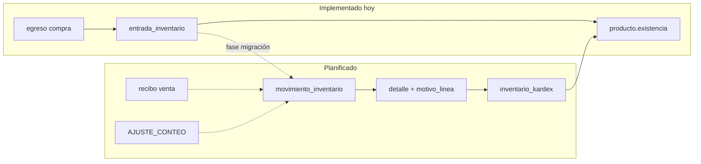

# Inventario — conceptos, estado actual y planificación

**Documento maestro:** [`POS-PLAN-MAESTRO.md`](./POS-PLAN-MAESTRO.md) · **Estado:** **APROBADO** (2026-06-06).

**Última actualización:** 2026-06-06  
**Propósito:** Onboarding para retomar el módulo de inventario en otra sesión (planeación + lo ya implementado).  
**Complemento operativo:** ver [`entradas-almacen.md`](./entradas-almacen.md) (entradas vinculadas a egresos — **ya funcional** en app).  
**Ventas, NC/ND, restauración de ticket:** ver [`ventas-trazabilidad-dian-plan.md`](./ventas-trazabilidad-dian-plan.md).  
**Finanzas, roles, backup BD, arqueo:** ver [`finanzas-egresos-resumen-planificacion.md`](./finanzas-egresos-resumen-planificacion.md).  
**Guía para cajeros (lenguaje sencillo):** ver [`guia-conceptos-pos-cajero.md`](./guia-conceptos-pos-cajero.md) §7 kardex.

> **Nota legal:** Este POS está pensado para establecimientos de **personas naturales NO responsables de IVA**, sin facturación electrónica DIAN. Aun así, se busca alinear **principios de trazabilidad** (entradas, salidas, saldos, responsable, documento) útiles para control interno y eventual libro de inventarios. **No es asesoría tributaria.**

---

## 1. Recuento de la sesión de planeación

### Qué se discutió

1. **Contexto POS** — repos `pos-relational-data-service` (backend :8088) e `infinito-ai-front` (Angular 17).
2. **Entradas de almacén** — ya implementadas: egreso tipo “compra proveedor” → borrador → confirmar → sube `producto.existencia`, precios, historial, bitácora. Ver handoff en `entradas-almacen.md`.
3. **Inventario ampliado (futuro)** — no solo compras por egreso, sino:
   - Salidas: vencidos, mermas sin recambio.
   - Entradas: donaciones, promociones de proveedor.
   - Conteo físico (máximo **un día**): ajuste inmediato de saldo al cerrar.
   - Ventas POS: **sí** deben descontar inventario al confirmar recibo.
4. **DIAN / trazabilidad** — la DIAN no exige nombres de tablas; exige poder reconstruir movimientos y saldos. Propuesta: **movimiento + kardex**, no muchas tablas de conteo.
5. **Un solo saldo por producto** — acordado: **un único número** “cuánto hay” (hoy `producto.existencia`; en el plan futuro puede renombrarse o unificarse, pero **no** dos columnas paralelas).
6. **Grupo espejo** — productos agrupados (ej. Savital control caída + Savital risos). El total del grupo se obtiene sumando saldos de productos; **no** almacenar total en `grupo_espejo` como fuente primaria.
7. **Simplicidad en conteos** — descartadas tablas extra (`conteo_fisico_resumen`, `inventario_metrica_*`). El conteo físico es un **tipo de movimiento** con columnas en el detalle (`cantidad_sistema`, `cantidad_contada`).

### Error en sesión anterior (revertido)

En una fase que debía ser solo planeación se implementó código experimental:

- Columna `producto.inventario` y `grupo_espejo.inventario`
- API `/api/inventario`
- Servicios `InventarioService*`, DTOs y cambios en frontend

**Todo eso fue revertido.** El código vuelve al estado funcional de **entradas de almacén** descrito en `entradas-almacen.md`.

Si en PostgreSQL local se ejecutó `inventario.sql` experimental, revertir manualmente:

```sql
ALTER TABLE producto DROP COLUMN IF EXISTS inventario;
ALTER TABLE grupo_espejo DROP COLUMN IF EXISTS inventario;
```

---

## 2. Qué está implementado hoy (no tocar sin plan)

| Área | Estado |
|------|--------|
| `entrada_inventario` + detalle | BD + backend + UI |
| `producto.existencia` | Sube al confirmar entrada de almacén |
| `historial_precio_producto` | Cambios de precio al confirmar entrada |
| Ventas (`recibo`) | **No** descuentan existencia aún |
| Kardex / movimientos unificados | **No implementado** (planificado) |
| Conteo físico | **No implementado** (planificado) |
| Mermas / donaciones | **No implementado** (planificado) |

Scripts BD vigentes para entradas:

```
pos-relational-data-service/src/main/resources/doc/contextos/database/
├── entrada_inventario.sql
├── historial_precio_producto.sql
└── historial_precio_producto_seed_chococono.sql  (demo)
```

---

## 3. Conceptos básicos (glosario)

### Saldo / existencia

Cantidad actual de unidades de un producto en almacén. **Decisión de planificación:** un solo campo en `producto` (hoy `existencia`). Todo movimiento confirmado actualiza ese saldo; no debe haber otro número “oficial” en paralelo.

### Movimiento de inventario

**Documento** que agrupa una operación (compra, venta, merma, conteo, donación). Tiene:

- Consecutivo y fecha del hecho
- Tipo (catálogo)
- Estado: `BORRADOR` → `CONFIRMADA` / `ANULADA`
- Usuario responsable
- Referencia opcional (`egreso_id`, `recibo_id`, etc.)

En el plan mínimo: tablas `movimiento_inventario` + `movimiento_inventario_detalle`.

### Kardex (libro auxiliar)

Registro **inmutable** (append-only) de cada cambio de cantidad. Por línea típicamente:

- `producto_id`, fecha
- Cantidad entrada / salida
- **Saldo resultante** después del movimiento
- Enlace al detalle del movimiento

Sirve para trazabilidad DIAN-style: reconstruir “cuánto había” en cualquier fecha y auditar quién movió qué.

**Regla:** no borrar filas de kardex; anular = movimiento reverso o estado `ANULADA` con traza.

### Tipo de movimiento

Catálogo (`tipo_movimiento_inventario`) con códigos como:

| Código | Dirección | Origen de negocio |
|--------|-----------|-------------------|
| `COMPRA_EGRESO` | Entrada | Confirmar `entrada_inventario` / egreso compra |
| `VENTA_POS` | Salida | Confirmar `recibo` |
| `DONACION` | Entrada | Donación (costo 0) |
| `PROMO_PROVEEDOR` | Entrada | Promoción proveedor |
| `MERMA_VENCIDO` | Salida | Producto vencido |
| `MERMA_SIN_RECAMBIO` | Salida | Pérdida sin reemplazo |
| `AJUSTE_CONTEO` | Ajuste ± | Conteo físico del día |

### motivo_linea

Campo de **texto (o código corto) en cada línea del detalle** del movimiento. Explica *por qué* cambió esa línea en particular.

Ejemplos:

- `"Lote vencido 2025-03-15"`
- `"Conteo anaquel pasillo 2"`
- `"Muestra promocional proveedor X"`

No sustituye el **tipo de movimiento** (clasificación global del documento); complementa el detalle para auditoría.

### Conteo físico (plan simplificado)

- Dura **como máximo un día** (acordado).
- **No** requiere tabla `conteo_fisico` separada: es un movimiento `AJUSTE_CONTEO`.
- En cada línea del detalle:
  - `cantidad_sistema` — saldo al abrir el conteo
  - `cantidad_contada` — lo contado
  - `cantidad` — magnitud del ajuste (varianza)
- Al **confirmar** el movimiento: actualizar saldo **de inmediato** (sin aprobación de gerente; no es requisito DIAN).
- Resúmenes (total líneas, varianza neta): **consultas SQL / vistas**, no tablas propias en fase 1.

### Grupo espejo

Agrupa presentaciones del mismo producto de marca (ej. “SAVITAL”). Cada producto tiene su **propio saldo**. El inventario del grupo = `SUM(saldo productos del grupo)` en consulta; no duplicar en columna del grupo.

---

## 4. Modelo de BD mínimo propuesto (fase siguiente — solo plan)

```text
establecimiento              -- NIT, régimen NO_RESPONSABLE_IVA (opcional 1 fila)
tipo_movimiento_inventario   -- catálogo
consecutivo_documento        -- numeración por año/tipo

movimiento_inventario        -- cabecera única para todos los tipos
movimiento_inventario_detalle
inventario_kardex            -- libro auxiliar inmutable

producto.existencia          -- único saldo (nombre puede mantenerse o unificarse luego)
```

**Migración gradual:** `entrada_inventario` sigue como flujo UI; al confirmar, además de lógica actual, crear movimiento `COMPRA_EGRESO` + líneas kardex. Luego unificar para que solo el kardex actualice el saldo.

**Descartado en fase 1 (simplicidad):**

- `conteo_fisico`, `conteo_fisico_linea`, `conteo_fisico_resumen`
- `inventario_metrica_producto`, `inventario_metrica_grupo`
- Columna `grupo_espejo.inventario` como fuente de verdad
- Segundo campo de saldo en `producto`

---

## 5. Decisiones cerradas (checklist)

- [x] Un solo saldo por producto
- [x] Venta POS descuenta inventario (al implementar movimientos)
- [x] Conteo ajusta saldo al confirmar, mismo día, sin workflow gerente
- [x] Conteo = movimiento `AJUSTE_CONTEO`, no tablas extra
- [x] Kardex obligatorio para trazabilidad
- [x] Métricas históricas = consultas, no tablas (fase 1)
- [ ] Escribir `inventario-modelo-minimo-v1.sql` (pendiente)
- [ ] Integrar venta POS con salida de inventario (pendiente)
- [ ] Refactor confirmación `entrada_inventario` → kardex (pendiente)

---

## 6. Diagrama objetivo



---

## 7. Cómo retomar en otra sesión

1. Leer [`POS-PLAN-MAESTRO.md`](./POS-PLAN-MAESTRO.md) §7 Sprint 3.
2. Leer este archivo + [`entradas-almacen.md`](./entradas-almacen.md).
3. Confirmar que no hay columnas `inventario` experimentales en BD local.
4. Ejecutar scripts Fase 2 según `ventas-trazabilidad-dian-plan.md` §3 (kardex).
5. Backend onboarding: `pos-relational-data-service/.../AI-ONBOARDING-basic.md`.

**Producto de prueba habitual:** CHOCOCONO — barcode `7702402054416`, id **656**.

---

*Planeación aprobada — ver POS-PLAN-MAESTRO.md. Implementado hoy: solo entradas de almacén según entradas-almacen.md.*
