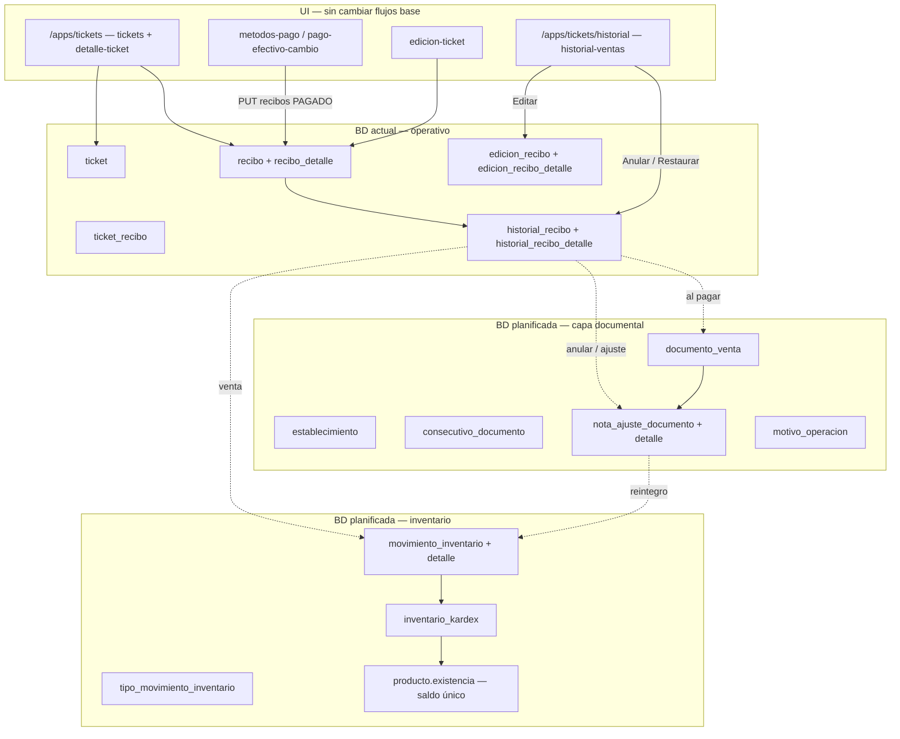

# Ventas, trazabilidad e inventario — planificación

**Documento maestro:** [`POS-PLAN-MAESTRO.md`](./POS-PLAN-MAESTRO.md) · **Estado:** **APROBADO** (2026-06-06) — incluye backfill histórico y historial Anulados/Restaurados.

**Última actualización:** 2026-06-06  
**Documentos relacionados:**

| Archivo | Contenido |
|---------|-----------|
| [`entradas-almacen.md`](./entradas-almacen.md) | Entradas de almacén por egreso — **implementado** |
| [`inventario-planificacion.md`](./inventario-planificacion.md) | Kardex, saldo único, conteo físico simplificado |
| [`finanzas-egresos-resumen-planificacion.md`](./finanzas-egresos-resumen-planificacion.md) | Egresos, resumen **ayuda gerencial**, roles, backup BD, arqueo |
| [`POS-PLAN-MAESTRO.md`](./POS-PLAN-MAESTRO.md) | Índice sesión, sprints, mapa repos, checklist |
| [`guia-conceptos-pos-cajero.md`](./guia-conceptos-pos-cajero.md) | **Guía cajero/dueño** — NC, kardex, arqueo en lenguaje sencillo |

> POS para persona natural **NO responsable de IVA** (sin FE obligatoria). Se planea **capa documental** (consecutivos, NC/ND, motivos) y **kardex de inventario** bajo la UI actual. No es asesoría tributaria.

---

## 1. Esquema objetivo (ventas + documentos + inventario)



### Relaciones clave (texto)

```text
documento_venta (1) ←—— historial_recibo (1)     al cerrar venta
nota_ajuste (N) ——→ documento_venta_origen (1)   NC total, NC/ND parcial, restauración
movimiento_inventario (N) ——→ documento_venta | nota_ajuste | entrada_inventario | recibo
inventario_kardex (N) ——→ movimiento_inventario_detalle (1)
```

---

## 2. Qué hay hoy vs qué falta

### Implementado (ventas)

| Pieza | Detalle |
|-------|---------|
| `POST /tickets` | Crea ticket en sesión |
| `GET /ticket-recibos/ticket/{id}` | Crea recibo `PENDIENTE_PAGO` (1) si no existe |
| `POST /recibo-detalles` | Líneas de venta |
| `PUT /recibos/{id}` | Pago → `estadoId: 2` → copia a `historial_*`, `incrementarVentas` |
| `PUT /historial-recibos/{id}?sesionId=` + `estadoId: 4` | Reabre en **EDICION** (`moveToEdition`) |
| `edicion-ticket` | Diff, pago adicional / devolución, botón **Sin cambios en productos** |
| Anular | `PUT historial-recibos` → estado anulado (sigla `AN` en front) |

### No implementado (objetivo)

| Tema | Gap |
|------|-----|
| Capa documental | Sin `documento_venta`, NC/ND, consecutivos |
| Inventario en venta | No descuenta `existencia`; no kardex |
| Anulación | No revierte ventas en producto; no NC formal; no reintegro stock |
| Pago por error | Solo anular o editar; sin flujo **restaurar ticket + motivo + kardex** |
| Estados | Posible desalineación `estado_recibos` (seed `ANU`/`PEN`) vs enum Java / siglas `AN`/`ED` en front |

### Estados de recibo (referencia)

| id | `ReciboEstado` (Java) | UI / significado |
|----|------------------------|------------------|
| 1 | `PENDIENTE_PAGO` | Ticket abierto — **modo inicial** de venta |
| 2 | `PAGADO` | Venta cerrada → historial |
| 3 | `ANULADO` | Venta anulada en historial |
| 4 | `EDICION` | Ticket reabierto desde historial para corregir |

---

## 3. Planificación de BD — de actual a objetivo

**Regla:** scripts en `pos-relational-data-service/src/main/resources/doc/contextos/database/` con prefijo ordenado. Ejecutar en ventanas, sin romper `entradas-almacen` ya en producción.

### Fase 0 — Catálogos y establecimiento (sin tocar ventas)

| Script planificado | Contenido |
|--------------------|-----------|
| `00_establecimiento.sql` | Tabla `establecimiento` (NIT/CC, régimen `NO_RESPONSABLE_IVA`, razón social) |
| `01_consecutivo_documento.sql` | Consecutivos por tipo: `VENTA`, `NC`, `ND`, `MOV_INVENTARIO` |
| `02_motivo_operacion.sql` | Catálogo de motivos (ver §6) |
| `03_tipo_movimiento_inventario.sql` | Seeds: `COMPRA_EGRESO`, `VENTA_POS`, `AJUSTE_CONTEO`, `REINTEGRO_VENTA`, mermas, donación, etc. |
| `04_alinear_estado_recibos.sql` | Unificar ids/siglas con enum y front (`PEN`, `PAG`, `ANU`, `ED` o ids 1–4 fijos) |

### Fase 1 — Capa documental (ventas)

| Tabla | Propósito |
|-------|-----------|
| `documento_venta` | Documento formal de cada venta cerrada (`historial_recibo_id`, consecutivo, fecha_hecho, total, método pago, usuario, sesión) |
| `nota_ajuste_documento` | NC o ND (`tipo` CREDITO/DEBITO, consecutivo, `documento_venta_origen_id`, `motivo_operacion_id`, total, observaciones) |
| `nota_ajuste_detalle` | Líneas (producto, cantidad, valor) |

**Migración de datos históricos (aprobada):** script `05_backfill_documento_venta.sql` — una fila por cada `historial_recibo` con `estado_id = 2`, consecutivo retrospectivo `VTA-LEGACY-*` o rango documentado. Ventas sin backfill siguen como **legacy** en UI. Ver glosario §12.7.

**Hook en aplicación (fase ejecución backend):** al `PUT /recibos` con `PAGADO`, insertar `documento_venta` en la misma transacción que hoy crea `historial_recibo`.

### Fase 2 — Inventario (kardex + saldo único)

| Script | Contenido |
|--------|-----------|
| `10_movimiento_inventario.sql` | Cabecera + detalle (incl. `cantidad_sistema`, `cantidad_contada` para conteo) |
| `11_inventario_kardex.sql` | Libro auxiliar inmutable |
| `12_unificar_saldo_producto.sql` | Un solo saldo en `producto.existencia` (deprecar duplicados si existieran); backfill |

Ver detalle en [`inventario-planificacion.md`](./inventario-planificacion.md).

**Hook venta:** al `PAGADO`, movimiento `VENTA_POS` + kardex (salida).  
**Hook reintegro:** movimiento `REINTEGRO_VENTA` + kardex (entrada) — §5.

### Fase 3 — Enlaces y auditoría

| Columna / tabla | Uso |
|-----------------|-----|
| `documento_venta.nota_ajuste_anulacion_id` | NC que anula el documento |
| `historial_recibo.documento_venta_id` | FK opcional para consultas rápidas |
| `movimiento_inventario.nota_ajuste_id` | Trazabilidad stock ↔ NC |
| `movimiento_inventario.motivo_linea` | Texto libre complementario |
| Bitácora / evento | Evento `RESTAURACION_TICKET`, `VENTA_POS`, etc. |

### Fase 4 — Integración `entrada_inventario`

Confirmación de entrada de almacén → mismo `movimiento_inventario` tipo `COMPRA_EGRESO` + kardex (mantener pantalla actual).

### Orden de ejecución recomendado

```text
0 → 1 → 2 → 3 → 4
     ↓
  backend hooks por fase
     ↓
  frontend (§7) tras hooks de restauración y documento_venta
```

---

## 4. Capa documental — diseño de tablas (borrador DDL mental)

```sql
-- Solo planificación; nombres y tipos sujetos a revisión

motivo_operacion (
  id, codigo, nombre, aplica_a  -- VENTA | NC | ND | INVENTARIO | RESTAURACION
)

documento_venta (
  id, consecutivo, anio, historial_recibo_id UNIQUE,
  fecha_hecho, total, metodo_pago_id, cliente_id,
  usuario_id, sesion_id, estado  -- VIGENTE | ANULADO
)

nota_ajuste_documento (
  id, tipo,  -- CREDITO | DEBITO
  consecutivo, anio,
  documento_venta_origen_id NOT NULL,
  motivo_operacion_id,
  motivo_texto,  -- lo que digita el cajero si aplica
  total_ajuste, fecha_hecho, usuario_id,
  historial_recibo_id NULL,  -- si genera nuevo historial al editar
  operacion_restauracion BOOLEAN DEFAULT FALSE
)

nota_ajuste_detalle (
  id, nota_ajuste_id, producto_id, cantidad, valor_unitario, subtotal
)
```

### Mapeo acciones UI → documentos

| Acción UI actual / nueva | Documento |
|--------------------------|-----------|
| Pagar ticket | `documento_venta` + mov. `VENTA_POS` |
| Anular factura (simple) | `nota_ajuste` NC total + anular `documento_venta` |
| **Anular y restaurar ticket** (§5) | NC total + `REINTEGRO_VENTA` + `moveToEdition` |
| Editar con diferencia ↑ | ND por delta |
| Editar con diferencia ↓ | NC por delta |
| Sin cambios en productos | Sin NC/ND de valor; opcional confirmación documental |

**Label en UI (planificado):** chip `VENTA 0042`, `NOTA CRÉDITO NC-0007`, `NOTA DÉBITO ND-0003`.

---

## 5. Caso: pago por error — restauración de ticket + reintegro inventario

### Problema

El cajero/administrador **pagó por error** (cerró el recibo). Necesita:

1. Dejar trazabilidad fiscal interna (NC por anulación de la venta errónea).
2. **Devolver cantidades al inventario** (kardex entrada `REINTEGRO_VENTA`).
3. **Reabrir el ticket en ventas** para corregir sin perder la UX de edición (equivalente a “Editar en Ventas”, pero con motivo y movimientos explícitos).

### Operación planificada: `RESTAURACION_TICKET`

**Código motivo:** `RESTAURACION_TICKET` (nombre: “Reintegro / restauración de ticket”).  
**Tipo movimiento inventario:** `REINTEGRO_VENTA` (dirección ENTRADA).

### Flujo backend planificado

```text
POST /historial-recibos/{historialId}/restaurar-ticket?sesionId=
Body: { "motivoOperacionCodigo": "RESTAURACION_TICKET", "motivoTexto": "..." }

Transacción:
  1. Validar historial PAGADO y documento_venta VIGENTE
  2. Crear nota_ajuste CREDITO (total = venta) + detalle por líneas
  3. Marcar documento_venta ANULADO (referencia NC)
  4. Por cada línea: movimiento_inventario REINTEGRO_VENTA + kardex (+cantidad)
  5. Revertir incrementarVentas (nuevo método en ProductRepository) — estadística
  6. Ejecutar lógica equivalente a moveToEdition (recibo EDICION, edicion_recibo, ticket nuevo)
  7. Opcional: bitácora evento RESTAURACION_TICKET
```

**Diferencia con “Editar en Ventas” actual:** el editar hoy **no** genera NC ni reintegro stock; solo mueve a edición. La restauración es el camino correcto cuando **ya se pagó mal** y hay que dejar huella completa.

### Flujo desde historial (UI planificada)

En `historial-ventas.component.html`, junto a **Editar en Ventas** y **Anular factura**:

| Botón | Acción |
|-------|--------|
| Editar en Ventas | Comportamiento actual (`estadoId: 4`) — corrección sin NC automática *(revisar si se depreca a favor de restaurar)* |
| Anular factura | NC + anulado **sin** reabrir ticket |
| **Restaurar ticket** (nuevo) | Diálogo motivo obligatorio → `POST .../restaurar-ticket` → navega a `/apps/tickets` con ticket en edición |

### Reabrir en modo inicial (`PENDIENTE_PAGO`)

Operación distinta, usada **desde `edicion-ticket`** cuando el usuario quiere volver el recibo a estado **1 (pendiente pago)** — ticket otra vez “en curso” sin finalizar la edición como venta nueva.

**Código motivo sugerido:** `REAPERTURA_PENDIENTE` o reutilizar `RESTAURACION_TICKET` con subtipo; preferible catálogo explícito:

| codigo | Uso |
|--------|-----|
| `RESTAURACION_TICKET` | Desde historial tras pago erróneo (NC + reintegro + edición) |
| `REAPERTURA_PENDIENTE` | Desde edición: volver a `PENDIENTE_PAGO` con motivo |

**Endpoint planificado:**

```text
POST /recibos/{reciboId}/reabrir-pendiente
Body: { "motivoOperacionCodigo": "REAPERTURA_PENDIENTE", "motivoTexto": "..." }
```

- `recibo.estadoId` → 1  
- Si hubo movimientos de edición que afectaron stock, definir reglas (fase ejecución).  
- No borrar `edicion_recibo` hasta cerrar o cancelar edición.

---

## 6. Catálogo `motivo_operacion` (seeds planificados)

| codigo | nombre | aplica_a |
|--------|--------|----------|
| `ERROR_PAGO` | Pago registrado por error | RESTAURACION |
| `RESTAURACION_TICKET` | Reintegro / restauración de ticket | RESTAURACION |
| `REAPERTURA_PENDIENTE` | Reapertura a pendiente de pago | VENTA |
| `DEVOLUCION_CLIENTE` | Devolución al cliente | NC |
| `CORRECCION_PRECIO` | Corrección de precio/cantidad | NC / ND |
| `ANULACION_ADMIN` | Anulación administrativa | NC |
| `MERMA_VENCIDO` | Producto vencido | INVENTARIO |
| … | (mermas, donación, conteo — ver inventario-planificacion) | INVENTARIO |

El usuario **siempre** puede ampliar `motivo_texto` (campo obligatorio en restauración / reapertura).

---

## 7. Planificación frontend (al ejecutar la planeación)

**Solo diseño.** Archivos principales:

| Ruta | Cambio |
|------|--------|
| `ventas/historial-ventas/` | Botón **Restaurar ticket** + diálogo motivo |
| `ventas/edicion-ticket/edicion-ticket.component.html` | Botón nuevo a la **derecha** de **Sin cambios en productos** |
| `ventas/edicion-ticket/edicion-ticket.component.ts` | Llamada `reabrir-pendiente`, validación motivo |
| `ventas/service/` | `documento-venta.service.ts`, `restauracion-ticket.service.ts` (nombres tentativos) |
| `ventas/detalle-ticket/` | Tras restaurar, foco en ticket reabierto; badge NC en cabecera si backend devuelve consecutivo |
| `ventas/historial-ventas/` | Mostrar chips `VENTA-xxx`, `NC-xxx` en fila del historial |

### 7.1 Historial — botón “Restaurar ticket”

- Ubicación: `historial-ventas.component.html`, barra de acciones (junto a Editar / Anular).
- Habilitado si: recibo pagado, no anulado, usuario `admin` o `cajero` (misma política que anular).
- Al clic: `MatDialog` con textarea **Motivo** (requerido, mín. 10 caracteres sugerido).
- Submit → `POST /historial-recibos/{id}/restaurar-ticket?sesionId=`.
- Éxito → snackbar con `NC-{consecutivo}` + redirect a `/apps/tickets` (ticket de edición activo en sesión).

### 7.2 Edición — botón “Reabrir ticket (pendiente de pago)”

- Ubicación: `edicion-ticket.component.html`, bloque `@if (cambios.length === 0 && diferencia === 0)` — contenedor `.finalizar-sin-cambios`.
- Layout planificado:

```html
<!-- Pseudocódigo layout -->
<div class="finalizar-sin-cambios flex gap-2">
  <button class="finalizar-sin-cambios-btn">Sin cambios en productos</button>
  <button class="reabrir-pendiente-btn" mat-stroked-button color="accent">
    Reabrir ticket (pendiente de pago)
  </button>
</div>
```

- Al clic: diálogo motivo obligatorio (`REAPERTURA_PENDIENTE`).
- Submit → `POST /recibos/{reciboId}/reabrir-pendiente`.
- Éxito → emitir evento al padre (`detalle-ticket`) para refrescar recibo en **PENDIENTE_PAGO** (estado 1): ticket vuelve al **modo inicial** de venta (agregar/quitar ítems, pagar de nuevo).
- Tooltip: “Vuelve el ticket a abierto; use si cerró por error y debe rehacer la venta desde cero.”

**No confundir:**

| Botón | Efecto |
|-------|--------|
| Sin cambios en productos | Finaliza edición sin cambiar líneas (cierra con mismo total) |
| Reabrir ticket (pendiente de pago) | `estadoId` → 1; ticket editable como venta nueva; motivo registrado |

### 7.3 Labels en historial (solo visual — sin FE)

- Historial y detalle: `@if (documentoVenta?.consecutivo)` → `<span class="doc-badge">VTA {{ consecutivo }}</span>`.
- Si `notaAjuste`: `NC interna: NC-{{ n }}` / `ND interna: ND-{{ n }}`.
- Sin cambiar formularios de pago ni lista de productos.

### 7.5 Historial `/apps/tickets/historial` — filtros y panel documental (acordado 2026-06-04)

**Archivo:** `historial-ventas.component.html` / `.ts`  
**Ruta:** `/apps/tickets/historial` (o equivalente en routing actual).

#### Filtros (mat-button-toggle-group)

| Valor | Label UI | Qué lista | API planificada |
|-------|----------|-----------|-----------------|
| `todos` | Todos | Ventas pagadas + anuladas + restauradas (sin duplicar filas) | `GET /historial-recibos/search?estado=todos` |
| `pagado` | Pagado | Solo `estado_id = PAGADO` y documento VIGENTE | `estado=pagado` *(default hoy)* |
| `anulados` | Anulados | Recibos anulados **con** NC asociada | `estado=anulado` + join `nota_ajuste` |
| `restaurados` | Restaurados | Ventas donde hubo **Restaurar ticket** (arrepentimiento de pago) | `restaurado=true` |

Añadir cuarto toggle **Restaurados** junto a los existentes (Todos / Pagado / Anulados).

#### ¿NC, ND o ambas en cada escenario?

| Escenario | Documentos generados | Qué ve el usuario |
|-----------|----------------------|-------------------|
| **Anular factura** (sin reabrir ticket) | **Solo NC** (nota crédito interna) por el total de la venta | Filtro **Anulados** |
| **Restaurar ticket** (pago erróneo) | **NC** por la venta errónea + reintegro inventario; luego ticket en edición; al re-pagar → **nueva VTA** | Filtro **Restaurados** |
| **Editar venta** — total sube | **ND** por el delta (diferencia a favor del negocio) | Filtro Pagado + badge en detalle |
| **Editar venta** — total baja | **NC** por el delta | Idem |
| **Reabrir pendiente** (desde edición) | Motivo registrado; **sin NC/ND de valor** si no hubo pago definitivo | No entra en Restaurados *(solo reapertura)* |

**Restaurados** muestra sobre todo la **NC de restauración** ligada a la venta original; si el usuario vuelve a pagar, el panel enlaza también la **VTA nueva**.

#### Lista izquierda (cada fila) — campos nuevos

Además de total, fecha, cliente:

```text
VTA-000042  ·  $45.000
12/05/2026 14:30  ·  Cliente anónimo
[chip NC-0007]   ← solo filtro Anulados o si tiene NC
[chip Restaurado] ← solo filtro Restaurados
```

#### Panel derecho «Detalles» — bloque **Trazabilidad documental** (nuevo, encima de líneas de producto)

Card `mat-card` colapsable **Documentos y operaciones**:

| Campo | Origen BD | Visible en |
|-------|-----------|------------|
| Comprobante venta | `documento_venta.consecutivo` | Todos / Pagado / Restaurados |
| Estado documento | VIGENTE / ANULADO | Todos |
| Nota crédito interna | `nota_ajuste` tipo CREDITO → `NC-{n}` | Anulados, Restaurados |
| Nota débito interna | `nota_ajuste` tipo DEBITO → `ND-{n}` | Pagado *(si edición subió total)* |
| Motivo catálogo | `motivo_operacion.nombre` | Anulados, Restaurados |
| Motivo texto | `nota_ajuste.motivo_texto` | Anulados, Restaurados |
| Usuario operación | `nota_ajuste.usuario_id` → nombre | Anulados, Restaurados |
| Fecha operación | `nota_ajuste.fecha_hecho` | Anulados, Restaurados |
| VTA nueva *(si aplica)* | `documento_venta` hijo tras re-pago | Restaurados |
| Enlace kardex | `movimiento_inventario` REINTEGRO / VENTA | Restaurados *(admin, tooltip)* |

**DTO planificado** (`HistorialReciboEnriquecidoDto`):

```typescript
interface HistorialReciboEnriquecidoDto extends HistorialReciboDto {
  documentoVenta?: {
    consecutivo: string;
    estado: 'VIGENTE' | 'ANULADO';
  };
  notasAjuste?: Array<{
    id: number;
    consecutivo: string;       // NC-0007 / ND-0003
    tipo: 'CREDITO' | 'DEBITO';
    totalAjuste: number;
    motivoCodigo: string;
    motivoNombre: string;
    motivoTexto?: string;
    usuarioNombre: string;
    fechaHecho: string;
    operacionRestauracion?: boolean;
  }>;
  documentoVentaNuevo?: { consecutivo: string };  // tras re-pago en restauración
  flags?: { restaurado?: boolean; anuladoConNc?: boolean };
}
```

**Endpoint:**

```text
GET /historial-recibos/search?fecha=&estado=anulado|restaurado|pagado|todos&page=&size=
GET /historial-recibos/{id}/documentos   (detalle panel; o incluir en search item)
```

#### Acciones por filtro

| Filtro | Botones activos en panel |
|--------|--------------------------|
| Pagado | Editar, Anular, Restaurar ticket, Imprimir |
| Anulados | Imprimir *(tirilla con ref. NC)*; **no** Editar/Anular |
| Restaurados | Ver trazabilidad; Imprimir VTA original; enlace a ticket reabierto si sigue en edición |

#### Botón **Restaurar ticket** (escenario arrepentimiento)

- Junto a Anular; habilitado solo en **Pagado**.
- Diálogo: motivo obligatorio (catálogo + texto).
- Éxito: snackbar `NC-{n} generada — ticket reabierto en Ventas`.
- Lista **Restaurados** incluye ese registro con NC + motivo + usuario.

#### Renombrar botón existente (labels §3.5)

| Actual | Planificado |
|--------|-------------|
| Anular factura | **Anular venta** |
| Editar en Ventas | **Corregir en ventas** *(o deprecar a favor de Restaurar ticket cuando hubo error de pago)* |

---

### 7.6 Indicador **«R»** en el tab del ticket (reabierto / restaurado)

Cuando el ticket proviene de **restaurar ticket** (`RESTAURACION_TICKET`) o de **reabrir pendiente** (`REAPERTURA_PENDIENTE`), el cajero debe reconocerlo en la barra de tabs sin leer el nombre completo.

**Ubicación:** `tickets.component.html` — dentro de `.tab-item`, junto al texto de `getTicketLabel(t)` (líneas ~127–134).

**Diseño planificado (elegir uno en ejecución):**

| Opción | Implementación |
|--------|----------------|
| A (recomendada) | Badge compacto `R` antes del label: `<span class="tab-restaurado-badge" title="Ticket restaurado/reabierto">R</span>` |
| B | `mat-icon` `restore` o `replay` (14px) + tooltip |
| C | Sufijo en nombre solo si no hay espacio: `historial hoy 12:30 · R` |

**Estilos:** clase `.tab-item--restaurado` (borde o fondo ámbar suave); badge circular 16px, fuente bold.

**Datos (backend → front):**

```typescript
// Extensión planificada en TicketDto / respuesta sesión
interface TicketDto {
  // ...
  flags?: {
    restaurado?: boolean;       // true tras POST restaurar-ticket
    reabiertoPendiente?: boolean; // true tras POST reabrir-pendiente
  };
  documentoReferencia?: string; // opcional: "NC-0007" para tooltip
}
```

Regla UI: mostrar **R** si `restaurado || reabiertoPendiente || recibo.estadoId === 4` (EDICION) **y** existe `edicion_recibo` o flag explícito (evitar R en tickets nuevos normales).

**Tooltip:** «Ticket reabierto — venta en corrección (restauración / pendiente de pago)».

**Archivos a tocar (ejecución):**

- `tickets.component.ts` / `.html` / `.scss`
- `tickets.service.ts` — mapear flags del API
- Backend: incluir flags al crear ticket en `moveToEdition` / `reabrir-pendiente`

---

## 8. Planificación backend (al ejecutar)

| Endpoint nuevo | Descripción |
|----------------|-------------|
| `POST /historial-recibos/{id}/restaurar-ticket` | NC + reintegro + `moveToEdition` |
| `POST /recibos/{id}/reabrir-pendiente` | Estado 1 + motivo |
| (existente) `PUT /recibos/{id}` PAGADO | + `documento_venta` + `VENTA_POS` kardex |
| (existente) `PUT historial-recibos` anular | + NC sin restaurar |

Servicios planificados: `DocumentoVentaService`, `NotaAjusteService`, extensión `InventarioMovimientoService`, `RestauracionTicketService`.

---

## 9. Impresión de tirilla — estado actual y plan (trazabilidad POS no RIVA)

### 9.1 Archivos relevantes

| Archivo | Rol hoy |
|---------|---------|
| `infinito-ai-front/ejemplo-imprimir-recibo.ts` | **Ejemplo legacy** (80 mm, título genérico «RECIBO DE PAGO», sin datos de establecimiento ni consecutivo). **No es el que usa la app en producción.** |
| `src/app/pages/apps/ventas/service/recibo-print.service.ts` | **Implementación real** (`printRecibo`, `registerRecentRecibo`, tirilla 58 mm). Usado desde `detalle-ticket`, `tickets`, `historial-ventas`, `pago-efectivo-cambio`. |
| `imprimir-recibo-preference.constants.ts` | `localStorage` `imprimir-recibo` |

Al ejecutar la planeación, **unificar** en `ReciboPrintService` y deprecar o actualizar `ejemplo-imprimir-recibo.ts` como referencia alineada al servicio.

### 9.2 Qué imprime hoy (`ReciboPrintService.buildReciboHtmlFragment`)

| Bloque | Contenido actual | ¿Cumple trazabilidad? |
|--------|------------------|------------------------|
| Título | `"Gestor infinito market"` **hardcodeado** | Parcial — debe salir de `establecimiento.nombre_comercial` o `razon_social` |
| Fecha/hora | Sí (`fechaCreacion` / `fechaEmision`) | Sí |
| Leyenda | `"Recibo no apto como factura"` | Parcial — falta régimen tributario explícito |
| Ítems | Cantidad × nombre, unitario, subtotal | Sí |
| Total / pago / cambio | Sí | Sí |
| Pie | CLIENTE, ATENDIO (`user-nombre` localStorage) | Parcial |
| **No imprime** | NIT/CC, consecutivo venta, `reciboId`, `ticketId`, NC/ND, régimen | **Falta** |

### 9.3 Qué debe llevar la tirilla (plan — persona natural NO responsable de IVA)

No es factura electrónica; es **comprobante de venta POS** con mínimos de identificación y numeración interna (control del establecimiento, no RIVA):

```text
┌─────────────────────────────────────┐
│     {establecimiento.razon_social}   │  ← centrado, negrita
│  NIT {nit}[-{dv}]  (si aplica)       │
│  {establecimiento.regimen_leyenda}   │  ← ver §9.4
│  {direccion corta opcional}          │
├─────────────────────────────────────┤
│  Doc. venta: {documento_venta}       │  ← ej. VTA-000042 (obligatorio plan)
│  Ticket: {ticket.nombre} (#{id})     │  ← opcional operativo
│  Fecha: {fecha}  Hora: {hora}        │
│  {leyenda_no_factura}                │
├─────────────────────────────────────┤
│  * 1 x Coca Cola                     │
│    $3.000              $3.000        │
├─────────────────────────────────────┤
│  TOTAL:                    $3.000    │
│  PAGO: Efectivo            $3.000    │
│  CAMBIO: (si aplica)                 │
├─────────────────────────────────────┤
│  CLIENTE: Anonimo                    │
│  ATENDIO: {cajero}                   │
└─────────────────────────────────────┘
```

**Reimpresión desde historial:** si la venta tiene NC de anulación previa, línea opcional: `Ref. NC-0007 (anulación)` — no en la tirilla de venta nueva limpia.

**Ticket restaurado (R):** opcional en tirilla tras re-pago: `Operación: REINTEGRO / nueva venta` (solo si `flags.restaurado`).

### 9.4 Texto de régimen tributario (`establecimiento`)

| Campo BD planificado | Uso en impresión |
|--------------------|------------------|
| `regimen_tributario` | Código: `NO_RESPONSABLE_IVA`, `SIMPLE`, etc. |
| (derivado) `regimen_leyenda_impresion` | Texto fijo en tirilla |

Seeds / reglas sugeridas:

| `regimen_tributario` | Línea en tirilla |
|----------------------|----------------|
| `NO_RESPONSABLE_IVA` | `Establecimiento NO RESPONSABLE DE IVA` |
| Otros | Configurable en `establecimiento` o `configuracion_app` |

Mantener además (o reemplazar) la línea actual:

- `Documento de venta — no constituye factura electrónica`  
  o la versión corta ya usada: `Recibo no apto como factura` **+** la línea de régimen.

### 9.5 Extensión planificada `ReciboImpresionOpciones`

```typescript
export interface ReciboImpresionEstablecimiento {
  razonSocial: string;
  nombreComercial?: string | null;
  nit?: string | null;
  digitoVerificacion?: string | null;
  regimenTributario: string;
  regimenLeyendaImpresion: string;  // texto listo para tirilla
  direccion?: string | null;
}

export interface ReciboImpresionOpciones {
  // ... existente ...
  establecimiento?: ReciboImpresionEstablecimiento | null;
  documentoVentaConsecutivo?: string | null;  // VTA-000042
  ticketId?: number | null;
  ticketNombre?: string | null;
  reciboId?: number | null;  // referencia interna (pie pequeño)
  notaAjusteReferencia?: string | null;  // NC-xxx si aplica
  operacionRestauracion?: boolean;
}
```

**API planificada:** `GET /establecimiento/actual` o incluir en configuración de sesión para no hardcodear «Gestor infinito market».

**Flujo al pagar:** tras `PUT /recibos` PAGADO, el front recibe (o consulta) `documentoVenta.consecutivo` y lo pasa a `registerRecentRecibo` / `printRecibo`.

### 9.6 Cambios por componente (ejecución frontend)

| Componente | Cambio |
|------------|--------|
| `ReciboPrintService` | Cabecera dinámica, consecutivo, régimen, pie con doc. venta |
| `detalle-ticket` | Tras pago exitoso, pasar `documentoVentaConsecutivo` + establecimiento |
| `historial-ventas` | Reimpresión con consecutivo histórico (desde `documento_venta` por `historial_recibo_id`) |
| `ejemplo-imprimir-recibo.ts` | Actualizar como espejo documentado del servicio o marcar `@deprecated` |

### 9.7 Checklist impresión (añadido a §10)

- [ ] Tabla `establecimiento` + endpoint lectura
- [ ] `documento_venta.consecutivo` disponible antes de imprimir
- [ ] `ReciboPrintService` sin strings hardcodeados de negocio
- [ ] Tirilla 58 mm probada en impresora POS
- [ ] Reimpresión historial muestra mismo consecutivo original
- [ ] `ejemplo-imprimir-recibo.ts` alineado o archivado

---

## 10. Checklist de ejecución (cuando salga de planeación)

### Base de datos

- [ ] Fase 0: catálogos + alinear `estado_recibos`
- [ ] Fase 1: tablas documentales + backfill opcional
- [ ] Fase 2: movimiento + kardex + saldo único
- [ ] Fase 3: FKs y eventos bitácora
- [ ] Fase 4: puente `entrada_inventario`

### Backend

- [ ] Hook PAGADO → documento + salida inventario
- [ ] `restaurar-ticket` + `reabrir-pendiente`
- [ ] Anular con NC sin restaurar
- [ ] Edición con NC/ND por delta
- [ ] Revertir `total_ventas` en restauración/anulación

### Frontend

- [ ] Historial: filtros **Anulados** y **Restaurados** + panel documentos §7.5
- [ ] Historial: Restaurar ticket + diálogo motivo
- [ ] Edición: botón derecho de “Sin cambios en productos”
- [ ] Badges VENTA / NC / ND
- [ ] Alinear siglas estados (`AN`, `ED`, `PAG`, `PEN`)
- [ ] Tab ticket: badge/icono **R** si restaurado / reabierto / edición
- [ ] Impresión: `ReciboPrintService` + establecimiento + consecutivo documento venta
- [ ] Financiero: renombres **ayuda gerencial**, disclaimers, badges en links — ver [`finanzas-egresos-resumen-planificacion.md`](./finanzas-egresos-resumen-planificacion.md) §3–§4

### Pruebas mínimas

- [ ] Pagar → kardex salida → existencia baja
- [ ] Restaurar ticket → NC + existencia sube + ticket en `/apps/tickets`
- [ ] Reabrir pendiente desde edición → estado 1 + motivo guardado
- [ ] Anular sin restaurar → NC sin ticket nuevo
- [ ] Entrada almacén sigue funcionando (`entradas-almacen.md`)

---

## 12. «DIAN Ready» — matriz consolidada (no RIVA)

**Qué significa aquí:** el POS puede **sostener una revisión o una auditoría de contador** con trazabilidad de ventas, ajustes, inventario y caja — **sin** facturación electrónica obligatoria. **No** significa FE, CUFE, resolución DIAN ni libro contable oficial.

**Alcance explícito fuera del producto (no implementar):**

| Fuera de alcance | Motivo |
|------------------|--------|
| Facturación electrónica / CUFE | No RIVA — sin obligación FE |
| Numeración por resolución DIAN | Solo consecutivo interno POS |
| Declaración de renta / utilidad fiscal | Contador + soportes externos |
| Conciliación bancaria completa | Tesorería; el arqueo es control interno |

### 12.1 Pilares y estado (plan vs hoy)

| Pilar | Qué debe existir | Documentado en | Implementado hoy |
|-------|------------------|----------------|------------------|
| **A — Identidad del obligado** | `establecimiento` (NIT, régimen, razón social); tirilla sin hardcode | §9, Fase 0 | **No** — nombre fijo en `ReciboPrintService` |
| **B — Documento de venta** | `documento_venta` + consecutivo `VTA-*` al pagar | §3 Fase 1 | **No** — solo `historial_recibo` |
| **C — Ajustes trazables** | NC/ND (`nota_ajuste_*`) en anular, editar delta, restaurar | §4–§5 | **No** — anular cambia estado sin NC |
| **D — Inventario auditable** | Kardex + salida en venta + reintegro en NC/restaurar | `inventario-planificacion.md` | **Parcial** — entradas almacén sí; venta no descuenta |
| **E — Tirilla coherente** | Cabecera establecimiento, consecutivo, régimen no RIVA, sin textos FE | §9, `finanzas` §3.5 | **Parcial** — ítems/total sí; cabecera no |
| **F — Caja / medios de pago** | Corte con ventas − egresos por medio; origen pago en egresos | `finanzas` §6 | **Parcial** — corte ventas sí; egresos sin medio |
| **G — Resumen gerencial honesto** | Labels ayuda gerencial; excluir anuladas cuando exista NC | `finanzas` §3 | **No** — aún “utilidad”; no filtra NC |
| **H — Seguridad y roles** | Quién anula/restaura/egreso/backup | `finanzas` §4 | **Parcial** — JWT roles; sin `funcionalidad_pos` |
| **I — Respaldo e historial** | BD ilimitada; backup `pg_dump` registrado | `finanzas` §5 | **Parcial** — Excel app; sin backup BD integrado |
| **J — Auditoría de cambios** | Bitácora en ventas anuladas, egresos, restauraciones | §3 Fase 3, `finanzas` §7 | **Parcial** — bitácora solo productos |
| **K — Export contador** | CSV ventas/NC/egresos/kardex solo lectura | `finanzas` §7–§8.3 | **No** |
| **L — Patrón ticket → historial** | Staging `recibo` + archivo `historial_recibo` | `finanzas` §6.7 | **Sí** — flujo implementado |

### 12.2 Gaps críticos (bloquean «DIAN Ready»)

Orden sugerido de cierre:

1. **Fase 0 + 1:** `establecimiento`, consecutivos, `documento_venta`, alinear `estado_recibos`.
2. **Hook PAGADO:** crear `documento_venta` + tirilla con consecutivo (§9).
3. **Anular / restaurar con NC** + motivo (§4–§5) — hoy la anulación **no deja documento de ajuste**.
4. **Fase 2 inventario:** kardex + `VENTA_POS` al pagar; reintegro al NC/restaurar.
5. **Labels §3 finanzas** + disclaimers (rápido; no sustituye B–D).
6. **Egreso `metodo_pago_id`** + corte que resta egresos (§6 finanzas).
7. **Bitácora** eventos venta/egreso/anulación (mínimo: código evento + usuario + id documento).

### 12.3 Gaps importantes (fase 2 — no bloquean mínimo viable)

| Gap | Notas |
|-----|-------|
| `restaurar-ticket` + tab **R** + `reabrir-pendiente` | UX y trazabilidad de correcciones |
| Roles `funcionalidad_pos` | Restringir anular/restaurar a admin |
| Backup BD + `backup_registro` | Respaldo ante revisión |
| Export contador | Entrega periódica al contador |
| Backfill `documento_venta` histórico | Opcional; ventas viejas quedan “legacy” |
| Resumen excluye anuladas | Tras capa NC |
| NTP / hora servidor | Tirillas con timestamp confiable |
| Manual 1 página + términos login | Expectativas del producto |

### 12.4 Coherencia entre MD (revisado 2026-06-04)

| Tema | Estado |
|------|--------|
| Labels UI sin “DIAN” / FE | Acordado en `finanzas` § principio + §3.5 |
| Arqueo = extender `corte_venta`, no tablas `arqueo_*` | Acordado `finanzas` §6.2 |
| Retención BD ilimitada; 5 años solo backups | Acordado `finanzas` §5.5 |
| NC/ND en UI | Usar **Nota crédito interna** / **Ajuste de venta** — evitar “documento DIAN” en chip |
| Impresión §9 | Alineado a §3.5 finanzas (comprobante POS, no FE) |

### 12.5 Checklist único «DIAN Ready mínimo» (marcar al ejecutar)

**Bloque obligatorio**

- [ ] `establecimiento` + `GET /establecimiento/actual`
- [ ] `documento_venta` en cada PAGADO + consecutivo en tirilla
- [ ] Anular venta → `nota_ajuste` CREDITO + documento ANULADO
- [ ] Kardex salida en venta + entrada en reintegro/anulación con stock
- [ ] Tirilla: NIT, régimen no RIVA, consecutivo, sin hardcode comercial
- [ ] Disclaimers ayuda gerencial (finanzas §3)
- [ ] Corte/arqueo incluye egresos por `metodo_pago` (finanzas §6.3)

**Bloque recomendado**

- [ ] `restaurar-ticket` + motivo + reintegro
- [ ] Bitácora ventas/egresos
- [ ] Roles anular/restaurar solo admin
- [ ] Backup `pg_dump` registrado
- [ ] Export CSV contador (solo lectura)

**Explicitamente no requerido para declarar «Ready»**

- [ ] FE / CUFE / proveedor tecnológico
- [ ] Tablas `arqueo_caja` duplicadas
- [ ] Purge datos > 5 años en BD

### 12.6 Plan de ejecución — 7 bloqueos (BD + backend + frontend)

Orden de sprints sugerido; cada bloque incluye **UI mínima** para cerrar «DIAN Ready mínimo» (§12.5).

| # | Bloqueo | BD / backend | Frontend |
|---|---------|--------------|----------|
| **1** | **Establecimiento** | `00_establecimiento.sql`; `GET /establecimiento/actual`; CRUD admin *(solo admin)* | Pantalla admin o formulario en configuración: NIT, razón social, régimen no RIVA; `ReciboPrintService` consume API |
| **2** | **documento_venta** | Fase 1 tablas + hook `PUT /recibos` PAGADO → insert `documento_venta` + consecutivo `VTA-*` | Badge `VTA-xxx` en historial lista + detalle; tirilla al pagar |
| **3** | **Anular con NC** | `PUT historial-recibos` anular → `nota_ajuste` CREDITO + `documento_venta` ANULADO + kardex reintegro | Filtro **Anulados** §7.5; panel NC id, usuario, fecha, motivo; botón renombrado **Anular venta** |
| **4** | **Kardex venta** | Fase 2 scripts; hook PAGADO → `VENTA_POS`; anular/restaurar → reintegro | Opcional: enlace «Ver movimiento inventario» en panel Restaurados *(admin)* |
| **5** | **Tirilla completa** | Respuesta pago incluye `documentoVenta` + establecimiento | `ReciboPrintService` §9; historial reimpresión con mismo consecutivo |
| **6** | **Corte + egresos** | `egreso.metodo_pago_id`; flags `metodo_pago`; `consultarRango` resta egresos | `egreso-edit`: origen de pago; `cierre-ventas`: columnas ventas/egresos/neto — ver `finanzas` §6.3 |
| **7** | **Bitácora** | Eventos `VENTA_POS`, `ANULACION_VENTA`, `RESTAURACION_TICKET`, `EGRESO_*` en `bitacora_usuario` | Sin pantalla obligatoria fase 1; opcional admin «Auditoría» |

**Historial — entregables transversales (bloques 2, 3, restaurar):**

- Filtro **Restaurados** §7.5
- Botón **Restaurar ticket**
- Card **Documentos y operaciones** en panel derecho
- `GET /historial-recibos/search` enriquecido

**Dependencias:**

```text
1 → 2 → 5        (establecimiento antes de tirilla)
2 → 3 → 4        (documento antes de NC y kardex ligado)
3 + restaurar    → filtros Anulados / Restaurados
6 independiente  (finanzas; paralelo tras 2)
7 transversal    (hooks en 3, 4, 6)
```

### 12.7 Glosario (términos de planeación)

| Término | Significado en este proyecto |
|---------|------------------------------|
| **Backfill histórico `documento_venta`** | Script **único** que recorre ventas **antiguas** en `historial_recibo` (anteriores al go-live de `documento_venta`) y les asigna un consecutivo retrospectivo (`VTA-LEGACY-0001`) o las deja sin consecutivo. **Opcional:** si no se ejecuta, las ventas viejas siguen válidas pero aparecen como **legacy** (sin `VTA-*` en historial). Las ventas **nuevas** siempre tendrán `VTA-*`. |
| **Legacy** | Ventas registradas **antes** de activar la capa documental; pueden no tener NC formal si se anularon con el flujo viejo. |
| **NTP** | *Network Time Protocol* — sincronizar el **reloj del servidor** con hora oficial de internet para que fecha/hora en tirillas y `historial_recibo.fecha_creacion` sean confiables. Recomendación de **infraestructura** (Linux `systemd-timesyncd` o cron con `ntpdate`), no pantalla del POS. |
| **Manual operativo** | Documento corto (1–2 páginas PDF o ayuda in-app) para el dueño: qué es comprobante POS, ayuda gerencial, arqueo, restaurar vs anular, que no sustituye contador. **Fase 2** — no bloquea Ready mínimo. |
| **pg_dump** | Comando **nativo de PostgreSQL** que exporta la base completa (schemas `public` + `security`) a un archivo `.sql` o `.dump` **binario**, apto para `pg_restore`. **No** es el Excel de Copias de seguridad de la app. Ver `finanzas` §5.6. |
| **NC / ND interna** | Nota crédito / débito **del POS** (control interno), no documento electrónico DIAN. NC = reduce valor de venta; ND = aumenta valor por corrección al alza. |

---

## 11. Índice de sesiones para IA

0. [`POS-PLAN-MAESTRO.md`](./POS-PLAN-MAESTRO.md) — sprints, repos, aprobaciones.  
1. Leer este archivo + `inventario-planificacion.md` + `entradas-almacen.md`.
2. Confirmar fase a implementar (no saltar Fase 2 antes de hooks PAGADO si se quiere coherencia stock).
3. **No** reintroducir columnas `producto.inventario` duplicadas; saldo único en `existencia` hasta renombrar.
4. Producto prueba: CHOCOCONO — barcode `7702402054416`, id **656**.

---

*Planeación aprobada — implementar por sprints en POS-PLAN-MAESTRO.md §7.*
